# Training log

**All runs below share one dataset split, seed and protocol, so every number is
directly comparable to every other.** Two groups:

1. **Baseline camera tests** — the same configs Lorenzo tried (efficientnet /
   frozen yolo26), re-run on *our* dataset.
2. **Our tests** — the three new techniques (dropout, depth pre-BEV, partial
   yolo unfreeze), each an A/B against its baseline.

## Dataset & protocol

- **Split (named):** train `0003 + 0007 + 0009`, val `0010`, **temporally
  sub-sampled** (`train_stride=8` → 2,143 frames, `val_stride=4` → 757 frames).
  KITTI-360 is 10 Hz, so stride-8 barely loses information but keeps a run
  ~11 min (efficientnet) / ~14 min (yolo26) on the RTX 2060.
- **Fixed:** `EPOCHS=5`, `LR=1e-3`, `ACCUM=4`, `SEED=0`, `MATCHER=igev`,
  decoder NMS on (`{0:2.0, 1:0.5, 2:1.0, 3:0.5}`), 4 classes
  (`VEHICLE / PERSON / TWO_WHEELER / TRAFFIC_SIGN`, TRAIN dropped).
- **Val ground truth** (drive 0010, 757 frames): VEHICLE 3985, PERSON 729,
  TWO_WHEELER 521, TRAFFIC_SIGN 375.
- Single run per config, single seed → treat single-run gaps of ±0.02–0.03 mAP
  as noise; read per-class AP (VEHICLE / TRAFFIC_SIGN carry the signal).
- Reproduce from `notebooks/training.ipynb` §2 knobs: `CAMERA_BACKBONE`,
  `HEAD_DROPOUT` / `WEIGHT_DECAY`, `REFINE_DEPTH`, `YOLO_UNFREEZE_LAST`.

## Summary (all runs, same split/seed)

| run | group | backbone | trainable | mAP | VEHICLE mean / AP@2 | TRAFFIC_SIGN mean | centre err (TP@2m) | best ep |
|---|---|---|---|---|---|---|---|---|
| base_eff | baseline | efficientnet | 1,066,790 | 0.105 | 0.391 / 0.522 | 0.027 | 0.730 m | 4 |
| base_yolo | baseline | yolo26 frozen | 771,974 | **0.188** | **0.464 / 0.585** | 0.063 | 0.627 m | 4 |
| dropout_eff | ours | efficientnet | 1,066,790 | 0.095 | 0.363 / 0.491 | 0.018 | 0.736 m | 4 |
| depth_eff | ours | efficientnet | 1,085,158 | 0.106 | 0.391 / 0.506 | 0.033 | **0.674 m** | 4 |
| unfreeze_yolo | ours | yolo26 (last-4) | 926,086 | 0.184 | 0.428 / 0.540 | **0.085** | 0.622 m | 3 |

(mean = mean AP over the 0.5/1/2/4 m bands.)

**Headline:** frozen **yolo26 ≫ efficientnet** (mAP 0.188 vs 0.105) — the
COCO-pretrained stem is by far the stronger camera branch and is the baseline the
new techniques should build on.

---

# 1) Baseline camera tests (Lorenzo's configs, our dataset)

### 1a) efficientnet (`base_eff`)

Camera-only, EfficientNet stem trained from scratch. `CameraOnlyDetector:
1,066,790 trainable`.

```
class         AP@0.5  AP@1    AP@2    AP@4      mean   n_gt
-----------------------------------------------------------
VEHICLE       0.116   0.355   0.522   0.573   0.391  3985
PERSON        0.001   0.001   0.001   0.001   0.001  729
TWO_WHEELER   0.000   0.000   0.000   0.000   0.000  521
TRAFFIC_SIGN  0.021   0.025   0.026   0.035   0.027  375

F1-optimal operating point @2 m:
class         prec    recall  F1      score
----------------------------------------------
VEHICLE       0.627   0.551   0.587   0.170
TRAFFIC_SIGN  0.148   0.109   0.126   0.100

mAP 0.105 | macro P 0.232 R 0.167 F1 0.181 @2 m | centre err (TP@2m) 0.730 m | 757 frames
```

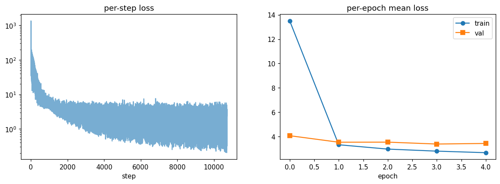
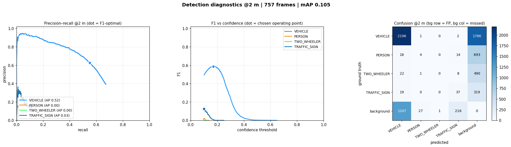


### 1b) yolo26 frozen (`base_yolo`) — the strong baseline

Camera-only, COCO-pretrained yolo26 backbone+neck frozen (only head / BEV /
context / P3 projection train). `CameraOnlyDetector: 771,974 trainable`.

```
class         AP@0.5  AP@1    AP@2    AP@4      mean   n_gt
-----------------------------------------------------------
VEHICLE       0.199   0.440   0.585   0.630   0.464  3985
PERSON        0.109   0.125   0.134   0.144   0.128  729
TWO_WHEELER   0.083   0.099   0.101   0.106   0.097  521
TRAFFIC_SIGN  0.051   0.056   0.065   0.081   0.063  375

F1-optimal operating point @2 m:
class         prec    recall  F1      score
----------------------------------------------
VEHICLE       0.742   0.590   0.657   0.193
PERSON        0.539   0.178   0.268   0.102
TWO_WHEELER   0.362   0.163   0.225   0.101
TRAFFIC_SIGN  0.182   0.216   0.197   0.116

mAP 0.188 | macro P 0.456 R 0.287 F1 0.337 @2 m | centre err (TP@2m) 0.627 m | 757 frames
```

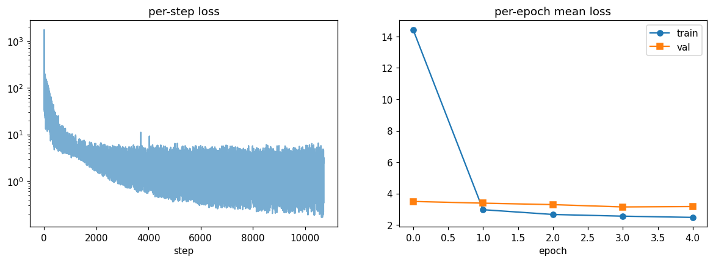
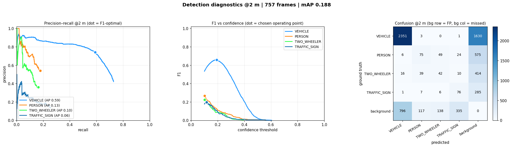
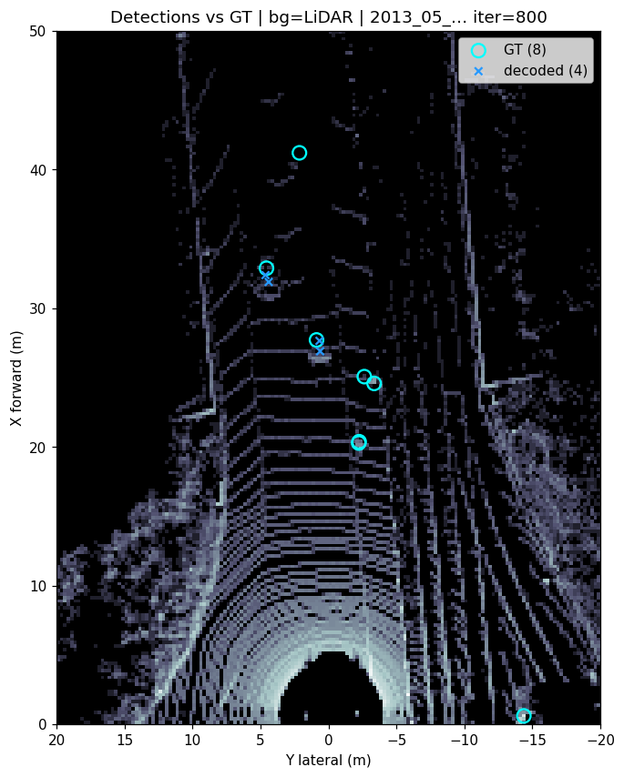

Frozen yolo26 wins on **every** class (and is the only baseline that detects
PERSON / TWO_WHEELER at all), with fewer trainable params than efficientnet —
transfer learning beats training the stem from scratch on this little data.

---

# 2) Our tests (new techniques, our dataset)

### 2a) Dropout + weight decay (`dropout_eff` vs `base_eff`)

`HEAD_DROPOUT=0.2 + WEIGHT_DECAY=1e-4` on the efficientnet baseline (AdamW
decoupled L2 + `Dropout2d` in the CenterPoint head). Same trainable count.

```
class         AP@0.5  AP@1    AP@2    AP@4      mean   n_gt
-----------------------------------------------------------
VEHICLE       0.106   0.321   0.491   0.532   0.363  3985
PERSON        0.000   0.000   0.000   0.000   0.000  729
TWO_WHEELER   0.000   0.000   0.000   0.000   0.000  521
TRAFFIC_SIGN  0.011   0.014   0.015   0.031   0.018  375

mAP 0.095 | macro P 0.197 R 0.158 F1 0.172 @2 m | centre err (TP@2m) 0.736 m | 757 frames
```

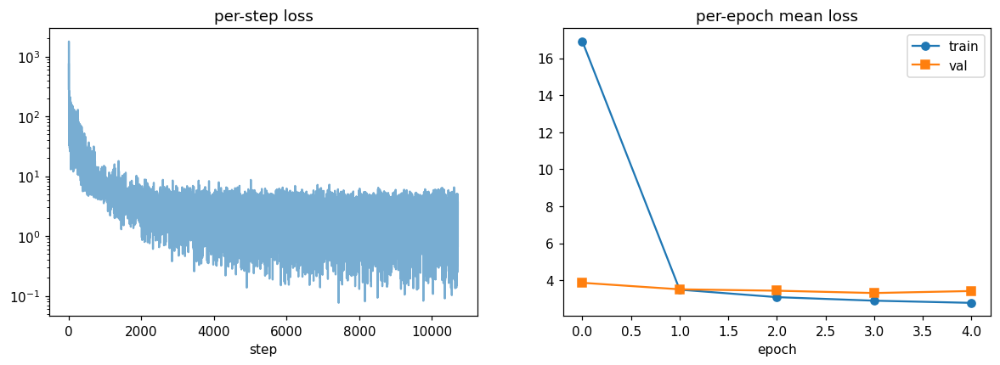
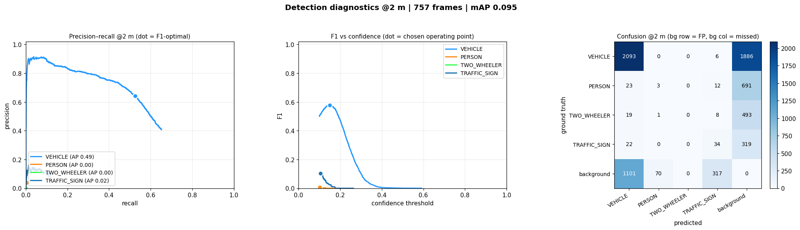


**Verdict:** small **regression** (mAP 0.095 vs 0.105, VEHICLE 0.363 vs 0.391).
5 epochs on 2 k frames don't overfit hard enough for this strength to pay — it
just slows the head. Plumbing is correct; retry lighter (p≈0.1, wd 1e-3) at full
scale, where overfitting is real (best-val came early).

### 2b) Depth pre-BEV (`depth_eff` vs `base_eff`)

New `DepthContextNet` (`StereoBEVConfig.refine_depth`, +18 k params) injects the
stereo depth into the context features **before** the BEV splat. NB the splat
cell index is a hard `.long()` (non-differentiable), so a depth-*position*
refiner gets zero gradient — this injects depth on the differentiable **feature**
path instead. `CameraOnlyDetector: 1,085,158 trainable`.

```
class         AP@0.5  AP@1    AP@2    AP@4      mean   n_gt
-----------------------------------------------------------
VEHICLE       0.134   0.377   0.506   0.548   0.391  3985
PERSON        0.000   0.000   0.001   0.003   0.001  729
TWO_WHEELER   0.000   0.000   0.000   0.000   0.000  521
TRAFFIC_SIGN  0.021   0.026   0.031   0.052   0.033  375

mAP 0.106 | macro P 0.203 R 0.174 F1 0.180 @2 m | centre err (TP@2m) 0.674 m | 757 frames
```

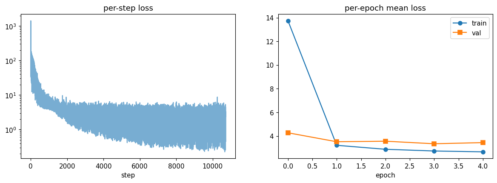
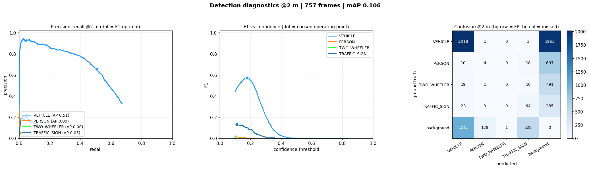
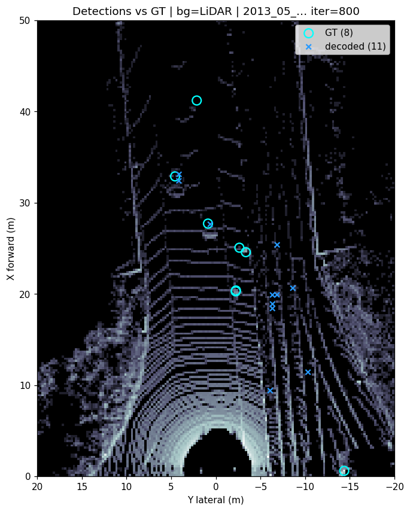

**Verdict:** mAP flat (0.106 vs 0.105) but **centre error 0.674 vs 0.730 m
(−8 %)** and TRAFFIC_SIGN 0.033 vs 0.027 — depth tightens localisation, exactly
what grounded stereo should buy. Cheap and directionally right → **keep for the
full run** (best judged on the yolo26 backbone).

### 2c) Partial yolo unfreeze (`unfreeze_yolo` vs `base_yolo`)

`YOLO_UNFREEZE_LAST=4` unfreezes the two C3k2 blocks that **produce P3** (the
tapped feature; anchored on `head.f[0]`, not the discarded P4/P5 tail);
+154 k trainable. `CameraOnlyDetector: 926,086 trainable`.

```
class         AP@0.5  AP@1    AP@2    AP@4      mean   n_gt
-----------------------------------------------------------
VEHICLE       0.185   0.403   0.540   0.583   0.428  3985
PERSON        0.110   0.127   0.137   0.144   0.130  729
TWO_WHEELER   0.070   0.095   0.105   0.112   0.096  521
TRAFFIC_SIGN  0.061   0.077   0.089   0.114   0.085  375

mAP 0.184 | macro P 0.423 R 0.270 F1 0.321 @2 m | centre err (TP@2m) 0.622 m | 757 frames
```

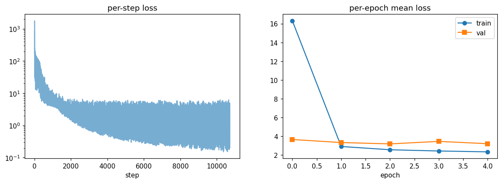
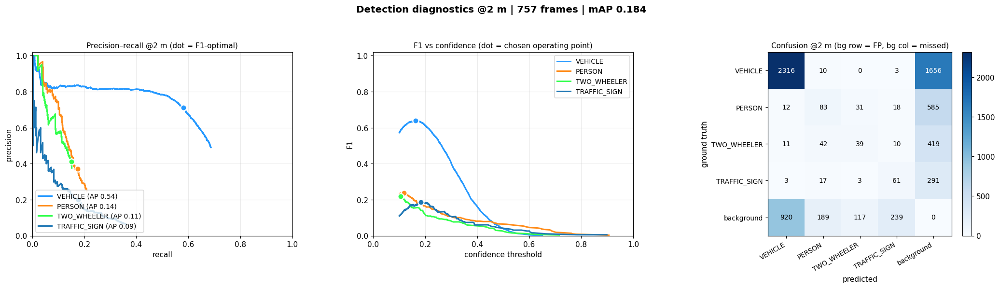
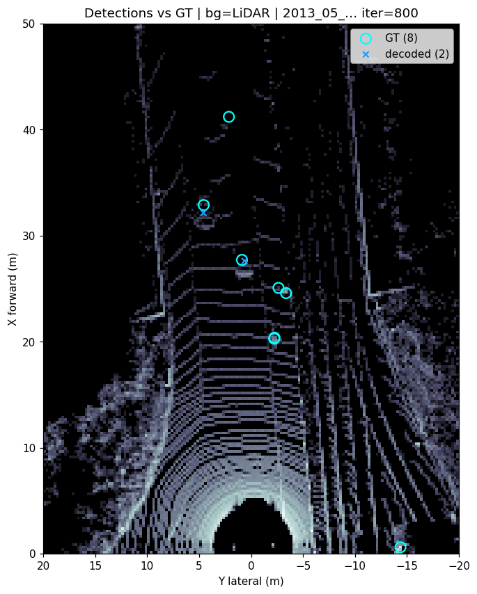

**Verdict:** mAP a wash (0.184 vs 0.188): trades **VEHICLE down (0.428 vs 0.464)
for TRAFFIC_SIGN up (0.085 vs 0.063, +35 %)** and overfits earlier (best ep 3 vs
4). Extra capacity helps small objects at a small cost to cars — marginal at
5 epochs / 2 k frames → revisit at full scale.

---

## Takeaways

- **Backbone is the big lever:** frozen yolo26 (0.188) ≫ efficientnet (0.105).
  Build everything on yolo26.
- **Depth pre-BEV** earns its place (better localisation, +18 k params) → keep.
- **Dropout 0.2 + wd 1e-4** hurts at this scale → drop or lighten.
- **yolo unfreeze-4** is neutral now (VEHICLE↓ / TRAFFIC_SIGN↑) → revisit with
  more data.

Runs auto-saved to `runs/<tag>_<ts>/` (git-ignored); images in
`docs/img/train/<tag>-{loss,result,example}.png`.
