# Training log

## Results summary

All camera/fusion rows share the same eval set (train=0007 / val=0003, 1010
frames, 4-class), so they are directly comparable — **bold = best in column**.
Row 0 (LiDAR-only, †) is on a different eval set (full drives, 3026 frames,
5-class), so its **AP-based columns are not comparable** and are left out of the
bold contest. Its centre error is a per-true-positive metric (insensitive to the
GT population), so it *is* comparable — and at 0.468 m it is the lowest of any
model, so it is bolded.

| # | Method | Params | mAP ↑ | VEH AP@2 ↑ | SIGN AP@2 ↑ | P ↑ | R ↑ | F1 ↑ | Err (m) ↓ |
|---|--------|-------:|------:|-----------:|------------:|----:|----:|-----:|----------:|
| 0 | LiDAR-only (full drives, 5-class) † | 223k | 0.222 | 0.588 | 0.269 | 0.314 | 0.274 | 0.286 | **0.468** |
| 1 | Camera baseline (SGBM, p3, frozen) | 772k | 0.184 | 0.492 | 0.147 | 0.279 | 0.274 | 0.273 | 0.648 |
| 2 | + IGEV stereo (p3) | 772k | 0.190 | 0.521 | 0.163 | 0.284 | 0.295 | 0.284 | 0.683 |
| 3 | EfficientNet-scratch (nms fix) | 1.07M | 0.142 | 0.420 | 0.130 | 0.284 | 0.224 | 0.250 | 0.707 |
| 4 | YOLO p3p4 | 805k | 0.224 | 0.603 | 0.212 | 0.368 | 0.299 | 0.328 | 0.614 |
| 5 | YOLO p3 + WD 1e-4 | 805k | 0.225 | 0.573 | 0.166 | 0.362 | 0.301 | 0.327 | 0.617 |
| 6 | YOLO p3p4p5 | 870k | 0.215 | 0.656 | 0.158 | 0.318 | 0.337 | 0.323 | 0.648 |
| 7 | MonoBEV (predicted depth) | 1.37M | 0.066 | 0.252 | 0.000 | 0.146 | 0.116 | 0.129 | 1.000 |
| 8 | Depth-ctx + p3p4 | 809k | 0.214 | 0.644 | 0.185 | 0.367 | 0.316 | 0.338 | 0.673 |
| 9 | Depth-ctx + p3p4 + WD + Dropout | 809k | 0.227 | 0.631 | 0.196 | **0.371** | **0.390** | **0.351** | 0.613 |
| 10 | Pipeline A (fused, concat) | 1.36M | 0.265 | 0.684 | 0.217 | 0.359 | 0.333 | 0.339 | 0.473 |
| 11 | Pipeline C (fused, cross-attn) | 1.42M | **0.276** | **0.701** | **0.232** | 0.344 | 0.375 | 0.350 | 0.476 |

† LiDAR-only was evaluated on the full drives (3026 frames, 5-class incl. TRAIN,
n_gt VEHICLE 15,975 vs 805 here) — a different frame set and GT population, so
its numbers are **not** directly comparable to the rest of the table.

**Metrics:** mAP = mean AP over classes and distance bands {0.5, 1, 2, 4 m}.
VEH/SIGN AP@2 = per-class AP at the 2 m match radius. P/R/F1 = macro
precision/recall/F1 at the F1-optimal operating point @2 m. Err = mean centre
error of true positives @2 m. TWO_WHEELER/TRAIN omitted (0 GT on this split);
PERSON ≈ 0 everywhere (18 GT).

**Takeaways:** fusion wins outright (Pipeline C tops mAP/VEH/SIGN and ~halves
the localization error); best camera-only is row 9 (depth-ctx + p3p4 + WD +
dropout); p3p4 is the sweet spot (P5 trades SIGN recall for VEHICLE AP); MonoBEV
is the control that justifies the grounded-stereo splat.


## CAMERA ONLY

### 1) baseline

```
print("grid:", G.GRID_SIZE, "| x:", G.X_RANGE, "| y:", G.Y_RANGE, "| classes:",
      G.CLASSES)

# --- run configuration -------------------------------------------------
MODEL = "camera"  # "lidar" | "camera" (baselines) | "pipeline_a" (fused)
EPOCHS = 5
LR = 1e-3
ACCUM = 4  # frames per optimizer step (batch-1 + accumulation)
VAL_SCENES = 1  # FALLBACK ONLY: used when kitti360_val isn't downloaded yet but
# kitti360_train has >1 log (holds out the last n). Ignored once the named
# kitti360_val split exists. int, or explicit log indices to hold out.
SEED = 0  # python/numpy/torch/CUDA RNGs (weight init, shuffling)

# camera stem (camera / pipeline_a only): "efficientnet" trains a ~1M-param CNN
# from scratch (weak); "yolo26" uses a COCO-pretrained backbone. FREEZE keeps it
# fixed so only the head/BEV/context train — the strong first baseline to try.
CAMERA_BACKBONE = "yolo26"  # "efficientnet" | "yolo26"
FREEZE_BACKBONE = True

tag = "" if MODEL == "lidar" else f"_{CAMERA_BACKBONE}"
CKPT = f"checkpoints/{MODEL}{tag}.pt"  # best-val weights (train_model writes it)
RESULTS = f"results/{MODEL}{tag}.json"  # eval report (§7 writes; §9 compares)

set_seed(SEED)  # reproducible runs (not bit-deterministic: CUDA atomics)
```

DATASET SPLIT
kitti360_train=0007 (2,890) / kitti360_val=0003 (1,010)


CameraOnlyDetector: 772,039 trainable | 2,572,280 frozen (yolo26 backbone)

21mitues

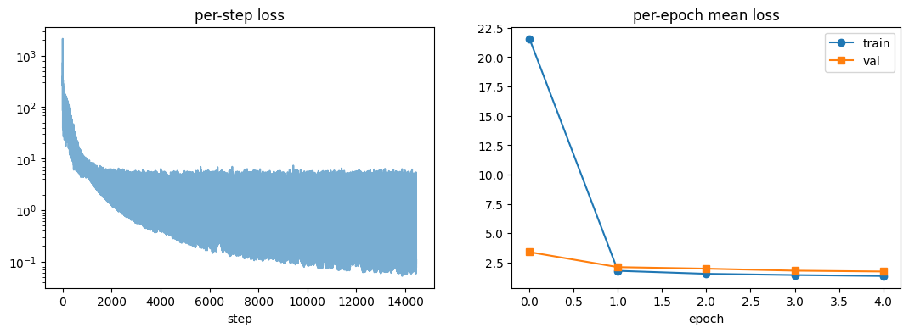

class         AP@0.5  AP@1    AP@2    AP@4      mean   n_gt
-----------------------------------------------------------
VEHICLE       0.225   0.423   0.492   0.514   0.413  805
PERSON        0.000   0.000   0.000   0.000   0.000  18
TWO_WHEELER   —       —       —       —       —      0
TRAFFIC_SIGN  0.115   0.139   0.147   0.154   0.139  274
TRAIN         —       —       —       —       —      0

F1-optimal operating point @2 m (apply 'confidence >= score' at deployment):
class         prec    recall  F1      score   
----------------------------------------------
VEHICLE       0.497   0.579   0.535   0.218   
PERSON        0.000   0.000   0.000   nan     
TWO_WHEELER   —       —       —       —       
TRAFFIC_SIGN  0.338   0.245   0.284   0.204   
TRAIN         —       —       —       —       

mAP 0.184 | macro P 0.279 R 0.274 F1 0.273 @2 m | mean centre error (TP@2m) 0.648 m | 1010 frame

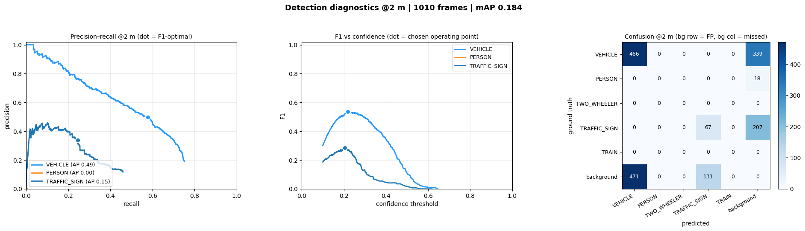

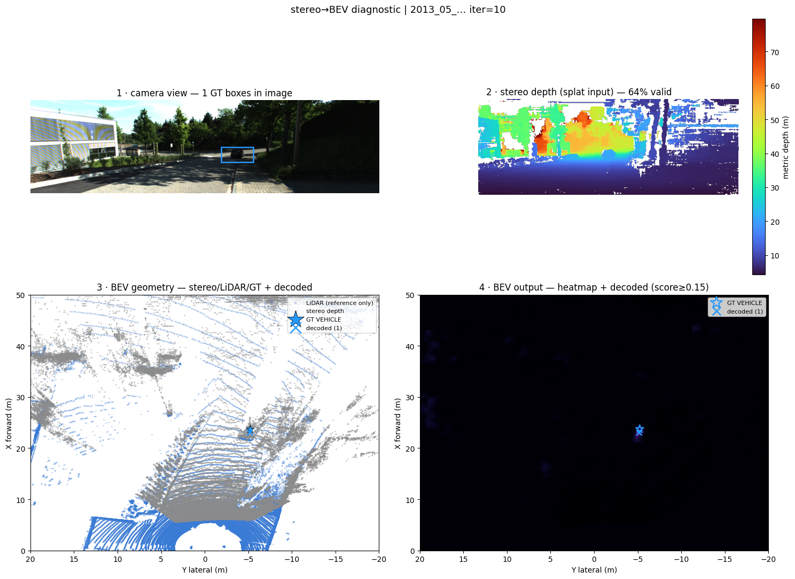


### 2) MATCHER = "igev"


class         AP@0.5  AP@1    AP@2    AP@4      mean   n_gt
-----------------------------------------------------------
VEHICLE       0.200   0.406   0.521   0.551   0.419  805
PERSON        0.000   0.000   0.000   0.000   0.000  18
TWO_WHEELER   —       —       —       —       —      0
TRAFFIC_SIGN  0.118   0.147   0.163   0.170   0.150  274
TRAIN         —       —       —       —       —      0

F1-optimal operating point @2 m (apply 'confidence >= score' at deployment):
class         prec    recall  F1      score   
----------------------------------------------
VEHICLE       0.592   0.506   0.545   0.200   
PERSON        0.000   0.000   0.000   nan     
TWO_WHEELER   —       —       —       —       
TRAFFIC_SIGN  0.259   0.380   0.308   0.110   
TRAIN         —       —       —       —       

mAP 0.190 | macro P 0.284 R 0.295 F1 0.284 @2 m | mean centre error (TP@2m) 0.683 m | 1010 frames

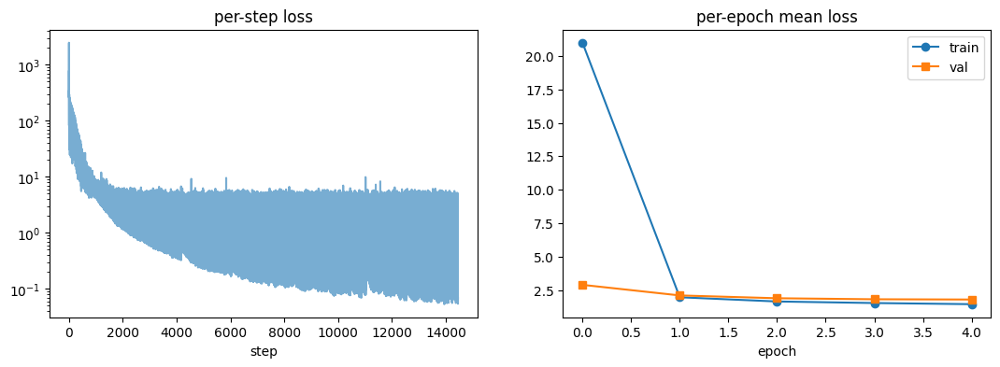
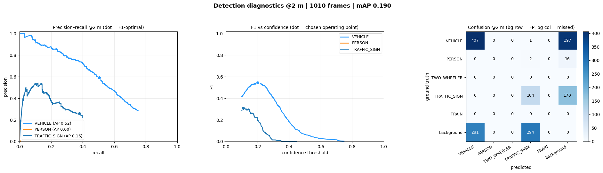

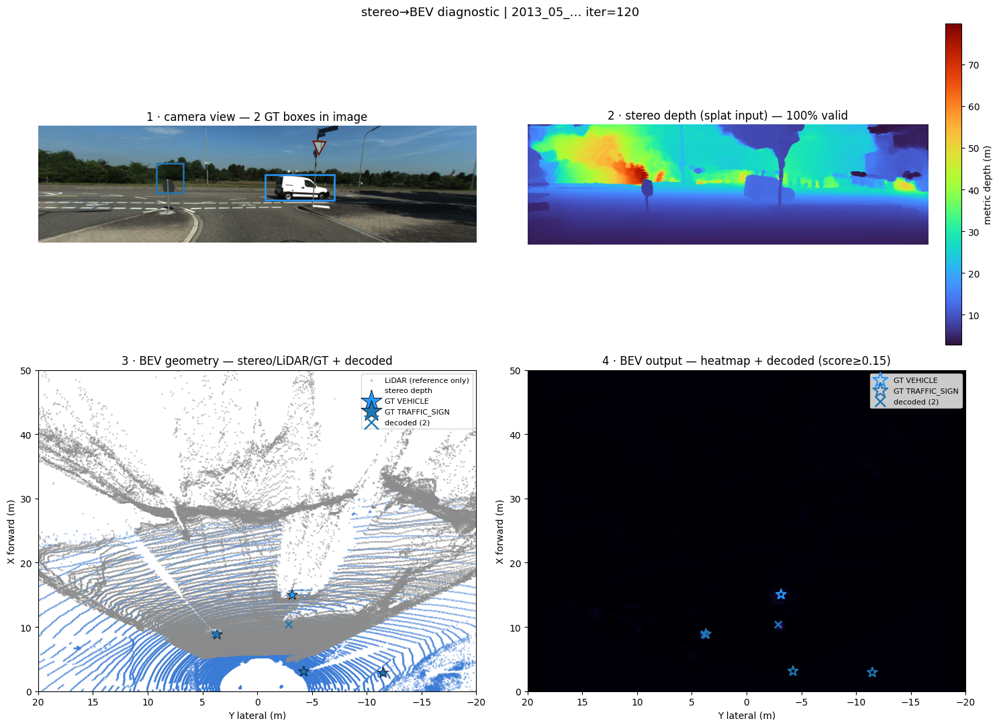
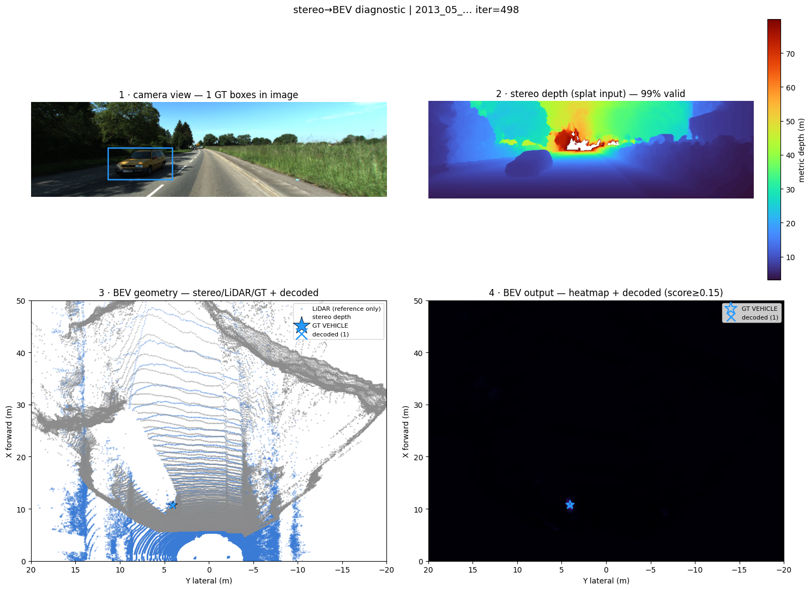

Issue with encoder nms
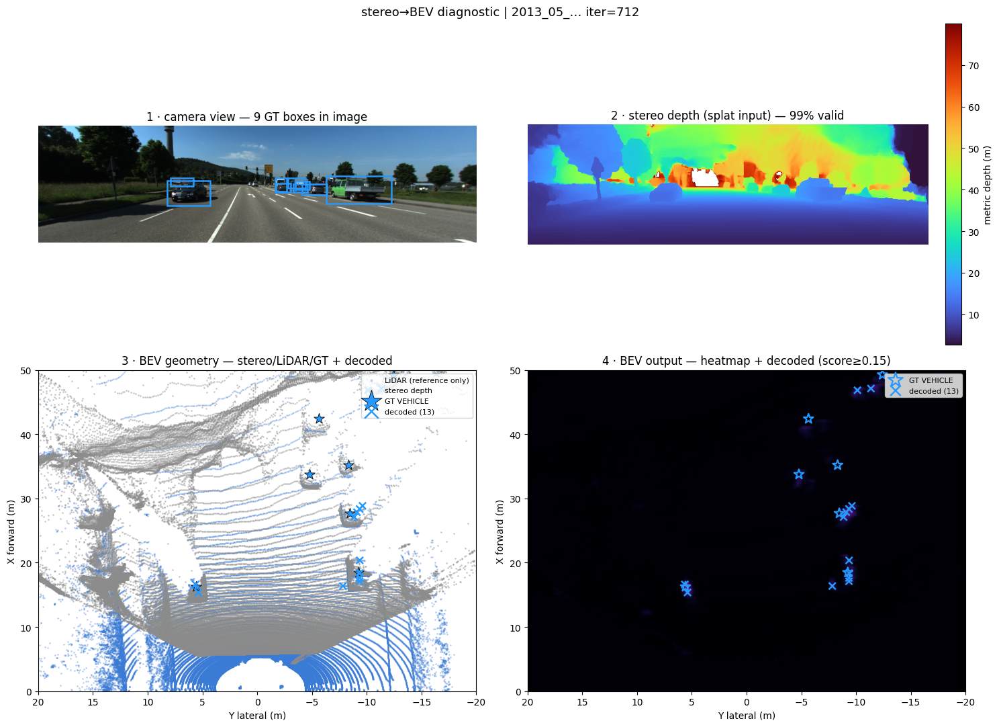


### 3) Efficient Network, nms fix
/home/lorenzo/Desktop/repo/AIRO/stereo-lidar-perception/runs/camera_efficientnet_igev_20260707_033656

fix: nms decoder
new file organization
remove TRAIN class

CameraOnlyDetector: 1,066,790 trainable
Note: more trainable parameters, but no tranferlearning
TODO: test also unfreezed yolo (maybe not the whole network)

class         AP@0.5  AP@1    AP@2    AP@4      mean   n_gt
-----------------------------------------------------------
VEHICLE       0.101   0.275   0.420   0.467   0.316  805
PERSON        0.000   0.000   0.000   0.000   0.000  18
TWO_WHEELER   —       —       —       —       —      0
TRAFFIC_SIGN  0.067   0.105   0.130   0.140   0.110  274

F1-optimal operating point @2 m (apply 'confidence >= score' at deployment):
class         prec    recall  F1      score   
----------------------------------------------
VEHICLE       0.616   0.448   0.519   0.135   
PERSON        0.000   0.000   0.000   0.161   
TWO_WHEELER   —       —       —       —       
TRAFFIC_SIGN  0.237   0.223   0.230   0.218   

mAP 0.142 | macro P 0.284 R 0.224 F1 0.250 @2 m | mean centre error (TP@2m) 0.707 m | 1010 frames

/home/lorenzo/Desktop/repo/AIRO/stereo-lidar-perception/runs/camera_efficientnet_igev_20260707_155342/plots/evaluation.png
/home/lorenzo/Desktop/repo/AIRO/stereo-lidar-perception/runs/camera_efficientnet_igev_20260707_155342/plots/loss_curves.png

### 4) Yolo p3p4
/home/lorenzo/Desktop/repo/AIRO/stereo-lidar-perception/runs/camera_yolo26_igev_20260707_162407

CameraOnlyDetector: 804,742 trainable | 2,572,280 frozen (yolo26 backbone)

fix nms in visualization

class         AP@0.5  AP@1    AP@2    AP@4      mean   n_gt
-----------------------------------------------------------
VEHICLE       0.189   0.458   0.606   0.648   0.475  805
PERSON        0.000   0.000   0.000   0.000   0.000  18
TWO_WHEELER   —       —       —       —       —      0
TRAFFIC_SIGN  0.166   0.202   0.212   0.215   0.199  274

### 4) WEIGHT_DECAY = 1e-4 (AdamW, dropout still 0)

Phase 1 regularization A/B: only weight decay on (head_dropout=0), yolo26 backbone frozen, MATCHER=igev, YOLO_LEVELS=p3. Dataset pinned to same drives as entry 1 (kitti360_train=0007 (2,890) / kitti360_val=0003 (1,010)).

CameraOnlyDetector: 804,742 trainable | 2,572,280 frozen (yolo26 backbone)

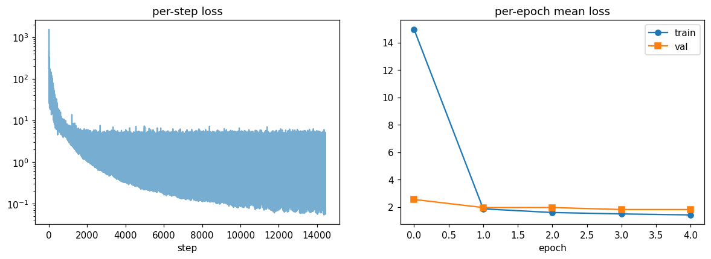

class         AP@0.5  AP@1    AP@2    AP@4      mean   n_gt
-----------------------------------------------------------
VEHICLE       0.205   0.431   0.573   0.626   0.459  805
PERSON        0.000   0.000   0.000   0.000   0.000  18
TWO_WHEELER   —       —       —       —       —      0
TRAFFIC_SIGN  0.123   0.153   0.166   0.179   0.155  274

F1-optimal operating point @2 m (apply 'confidence >= score' at deployment):
class         prec    recall  F1      score   
----------------------------------------------
VEHICLE       0.730   0.548   0.626   0.199   
PERSON        0.000   0.000   0.000   0.153   
TWO_WHEELER   —       —       —       —       
TRAFFIC_SIGN  0.355   0.354   0.355   0.214   

mAP 0.225 | macro P 0.362 R 0.301 F1 0.327 @2 m | mean centre error (TP@2m) 0.617 m | 1010 frames


### 4) FIX NMS

bigger nsm for vehicles
class         AP@0.5  AP@1    AP@2    AP@4      mean   n_gt
-----------------------------------------------------------
VEHICLE       0.187   0.451   0.603   0.650   0.473  805
PERSON        0.000   0.000   0.000   0.000   0.000  18
TWO_WHEELER   —       —       —       —       —      0
TRAFFIC_SIGN  0.166   0.202   0.212   0.215   0.199  274

F1-optimal operating point @2 m (apply 'confidence >= score' at deployment):
class         prec    recall  F1      score   
----------------------------------------------
VEHICLE       0.747   0.544   0.630   0.199   
PERSON        0.000   0.000   0.000   0.153   
TWO_WHEELER   —       —       —       —       
TRAFFIC_SIGN  0.355   0.354   0.355   0.214   

mAP 0.224 | macro P 0.368 R 0.299 F1 0.328 @2 m | mean centre error (TP@2m) 0.614 m | 1010 frames


### 5) yolo p3p4p5

CameraOnlyDetector: 870,278 trainable | 2,572,280 frozen (yolo26 backbone)

class         AP@0.5  AP@1    AP@2    AP@4      mean   n_gt
-----------------------------------------------------------
VEHICLE       0.179   0.461   0.656   0.680   0.494  805
PERSON        0.000   0.000   0.000   0.000   0.000  18
TWO_WHEELER   —       —       —       —       —      0
TRAFFIC_SIGN  0.110   0.148   0.158   0.181   0.149  274

F1-optimal operating point @2 m (apply 'confidence >= score' at deployment):
class         prec    recall  F1      score   
----------------------------------------------
VEHICLE       0.713   0.643   0.677   0.180   
PERSON        0.000   0.000   0.000   0.112   
TWO_WHEELER   —       —       —       —       
TRAFFIC_SIGN  0.242   0.369   0.292   0.185   

mAP 0.215 | macro P 0.318 R 0.337 F1 0.323 @2 m | mean centre error (TP@2m) 0.648 m | 1010 frames

Better for vehicles, worst for small objects
Maybe keep only p3p4


### 5) MONO BEV

onoOnlyDetector: 1,372,847 trainable | 2,572,280 frozen (yolo26 backbone)

class         AP@0.5  AP@1    AP@2    AP@4      mean   n_gt
-----------------------------------------------------------
VEHICLE       0.016   0.086   0.252   0.435   0.197  805
PERSON        0.000   0.000   0.000   0.000   0.000  18
TWO_WHEELER   —       —       —       —       —      0
TRAFFIC_SIGN  0.000   0.000   0.000   0.001   0.000  274

F1-optimal operating point @2 m (apply 'confidence >= score' at deployment):
class         prec    recall  F1      score   
----------------------------------------------
VEHICLE       0.437   0.348   0.387   0.145   
PERSON        0.000   0.000   0.000   nan     
TWO_WHEELER   —       —       —       —       
TRAFFIC_SIGN  0.000   0.000   0.000   0.103   

mAP 0.066 | macro P 0.146 R 0.116 F1 0.129 @2 m | mean centre error (TP@2m) 1.000 m | 1010 frames


#### 6) DEPTH + P3P4

CameraOnlyDetector: 809,350 trainable | 2,572,280 frozen (yolo26 backbone)

class         AP@0.5  AP@1    AP@2    AP@4      mean   n_gt
-----------------------------------------------------------
VEHICLE       0.123   0.424   0.644   0.684   0.469  805
PERSON        0.002   0.002   0.002   0.002   0.002  18
TWO_WHEELER   #### 6) DEPTH + P3P4—       —       —       —       —      0
TRAFFIC_SIGN  0.124   0.174   0.185   0.200   0.171  274

F1-optimal operating point @2 m (apply 'confidence >= score' at deployment):
class         prec    recall  F1      score   
----------------------------------------------
VEHICLE       0.742   0.583   0.653   0.184   
PERSON        0.043   0.056   0.049   0.102   
TWO_WHEELER   —       —       —       —       
TRAFFIC_SIGN  0.316   0.310   0.313   0.282   

mAP 0.214 | macro P 0.367 R 0.316 F1 0.338 @2 m | mean centre error (TP@2m) 0.673 m | 1010 frames
VEHICLE       0.619   0.645   0.632   0.104   
PERSON        0.000   0.000   0.000   0.117   
TWO_WHEELER   —       —       —       —       
TRAFFIC_SIGN  0.318   0.376   0.344   0.129   

mAP 0.205 | macro P 0.312 R 0.340 F1 0.325 @2 m | mean centre error (TP@2m) 0.593 m | 1010 frames

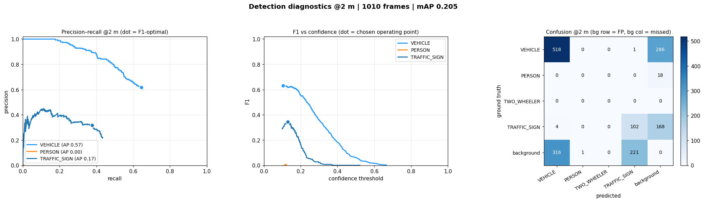


#### 6) DEPTH + P3P4 + AdamW + Dropout

WEIGHT_DECAY = 1e-4
HEAD_DROPOUT = 0.1

CameraOnlyDetector: 809,350 trainable | 2,572,280 frozen (yolo26 backbone)

class         AP@0.5  AP@1    AP@2    AP@4      mean   n_gt
-----------------------------------------------------------
VEHICLE       0.184   0.448   0.631   0.688   0.488  805
PERSON        0.007   0.008   0.008   0.008   0.007  18
TWO_WHEELER   —       —       —       —       —      0
TRAFFIC_SIGN  0.153   0.184   0.196   0.211   0.186  274

F1-optimal operating point @2 m (apply 'confidence >= score' at deployment):
class         prec    recall  F1      score   
----------------------------------------------
VEHICLE       0.761   0.573   0.653   0.190   
PERSON        0.029   0.222   0.052   0.109   
TWO_WHEELER   —       —       —       —       
TRAFFIC_SIGN  0.323   0.376   0.347   0.200   

mAP 0.227 | macro P 0.371 R 0.390 F1 0.351 @2 m | mean centre error (TP@2m) 0.613 m | 1010 frames

#### 7) DEPTH + P3 (ignore it!)

class         AP@0.5  AP@1    AP@2    AP@4      mean   n_gt
-----------------------------------------------------------
VEHICLE       0.172   0.454   0.633   0.677   0.484  805
PERSON        0.000   0.000   0.000   0.000   0.000  18
TWO_WHEELER   —       —       —       —       —      0
TRAFFIC_SIGN  0.092   0.132   0.134   0.147   0.126  274

F1-optimal operating point @2 m (apply 'confidence >= score' at deployment):
class         prec    recall  F1      score   
----------------------------------------------
VEHICLE       0.703   0.625   0.661   0.206   
PERSON        0.000   0.000   0.000   0.132   
TWO_WHEELER   —       —       —       —       
TRAFFIC_SIGN  0.241   0.318   0.274   0.205   

mAP 0.204 | macro P 0.315 R 0.314 F1 0.312 @2 m | mean centre error (TP@2m) 0.651 m | 1010 frames

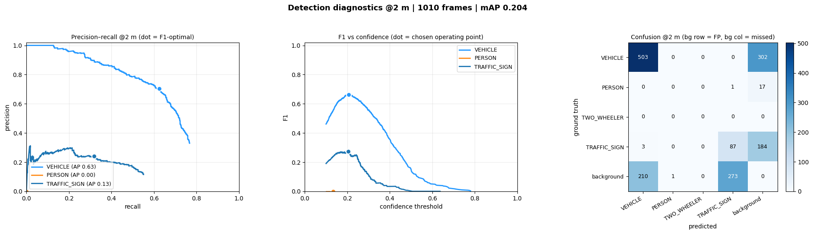
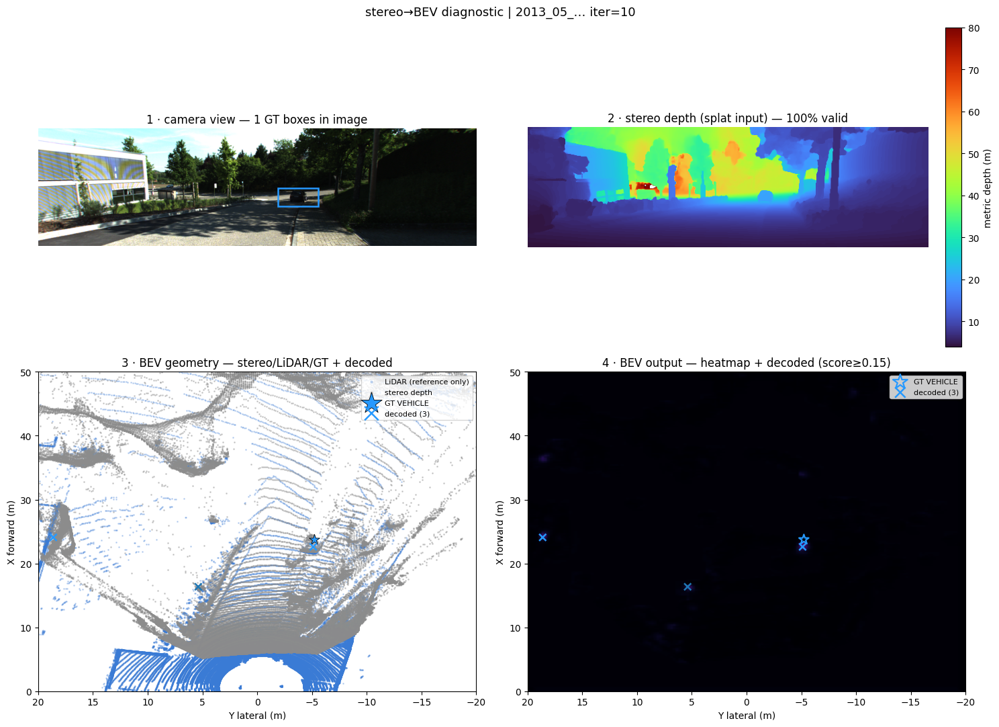

#### LIDAR ONLY

LidarOnlyDetector: 223,174 trainable

class         AP@0.5  AP@1    AP@2    AP@4      mean   n_gt
-----------------------------------------------------------
VEHICLE       0.419   0.551   0.588   0.613   0.543  15975
PERSON        0.150   0.152   0.154   0.168   0.156  2911
TWO_WHEELER   0.122   0.141   0.145   0.153   0.140  2090
TRAFFIC_SIGN  0.255   0.260   0.269   0.295   0.269  1503
TRAIN         0.000   0.000   0.000   0.000   0.000  112

F1-optimal operating point @2 m (apply 'confidence >= score' at deployment):
class         prec    recall  F1      score   
----------------------------------------------
VEHICLE       0.589   0.557   0.573   0.268   
PERSON        0.246   0.321   0.279   0.132   
TWO_WHEELER   0.257   0.237   0.247   0.147   
TRAFFIC_SIGN  0.479   0.253   0.331   0.218   
TRAIN         0.000   0.000   0.000   nan     

mAP 0.222 | macro P 0.314 R 0.274 F1 0.286 @2 m | mean centre error (TP@2m) 0.468 m | 3026 frames

HEADLINE  mAP 0.222  |  macro F1 0.286 @2 m  |  mean centre err 0.468 m


#### 8) PIPELINE A

DEPTH + P3P4 + AdamW + Dropout

PipelineA: 1,364,294 trainable | 2,572,280 frozen (yolo26 backbone)

class         AP@0.5  AP@1    AP@2    AP@4      mean   n_gt
-----------------------------------------------------------
VEHICLE       0.370   0.606   0.684   0.697   0.589  805
PERSON        0.000   0.000   0.000   0.000   0.000  18
TWO_WHEELER   —       —       —       —       —      0
TRAFFIC_SIGN  0.186   0.205   0.217   0.219   0.207  274

F1-optimal operating point @2 m (apply 'confidence >= score' at deployment):
class         prec    recall  F1      score   
----------------------------------------------
VEHICLE       0.798   0.607   0.690   0.191   
PERSON        0.000   0.000   0.000   0.167   
TWO_WHEELER   —       —       —       —       
TRAFFIC_SIGN  0.280   0.391   0.326   0.175   

mAP 0.265 | macro P 0.359 R 0.333 F1 0.339 @2 m | mean centre error (TP@2m) 0.473 m | 1010 frames

#### 8) PIPELINE C

PipelineC: 1,415,755 trainable | 2,572,280 frozen (yolo26 backbone)

class         AP@0.5  AP@1    AP@2    AP@4      mean   n_gt
-----------------------------------------------------------
VEHICLE       0.391   0.600   0.701   0.716   0.602  805
PERSON        0.000   0.000   0.000   0.000   0.000  18
TWO_WHEELER   —       —       —       —       —      0
TRAFFIC_SIGN  0.191   0.231   0.232   0.247   0.226  274

F1-optimal operating point @2 m (apply 'confidence >= score' at deployment):
class         prec    recall  F1      score   
----------------------------------------------
VEHICLE       0.767   0.670   0.715   0.165   
PERSON        0.000   0.000   0.000   0.126   
TWO_WHEELER   —       —       —       —       
TRAFFIC_SIGN  0.265   0.456   0.335   0.170   

mAP 0.276 | macro P 0.344 R 0.375 F1 0.350 @2 m | mean centre error (TP@2m) 0.476 m | 1010 frames


## BIG DATASET

#### 8) PIPELINE C. no depth

PipelineC: 1,411,147 trainable | 2,572,280 frozen (yolo26 backbone)

class         AP@0.5  AP@1    AP@2    AP@4      mean   n_gt
-----------------------------------------------------------
VEHICLE       0.556   0.682   0.737   0.752   0.682  15975
PERSON        0.387   0.391   0.394   0.415   0.397  2911
TWO_WHEELER   0.300   0.367   0.378   0.403   0.362  2090
TRAFFIC_SIGN  0.296   0.301   0.309   0.326   0.308  1503

F1-optimal operating point @2 m (apply 'confidence >= score' at deployment):
class         prec    recall  F1      score   
----------------------------------------------
VEHICLE       0.766   0.804   0.785   0.227   
PERSON        0.499   0.423   0.458   0.239   
TWO_WHEELER   0.510   0.400   0.448   0.249   
TRAFFIC_SIGN  0.586   0.254   0.355   0.342   

mAP 0.437 | macro P 0.590 R 0.470 F1 0.511 @2 m | mean centre error (TP@2m) 0.339 m | 3026 frames

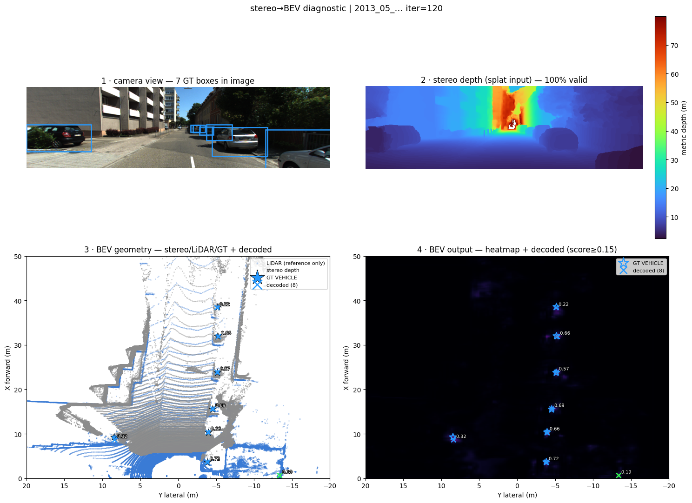

#### 9) PIPELINE A, depth-ctx

runs/pipeline_a_yolo26_igev_20260707_203755 — git 68414af

PipelineA: 1,364,294 trainable | 2,572,280 frozen (yolo26 backbone)

EPOCHS=50, PATIENCE=50, but the run only got to 7 epochs (best-val checkpoint = epoch 3, lowest val_loss 2.224; val_loss climbs after that — overfitting past ep3). ~3h48m wall clock.

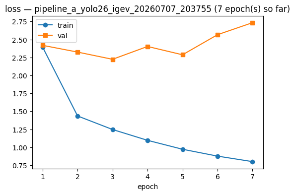

class         AP@0.5  AP@1    AP@2    AP@4      mean   n_gt
-----------------------------------------------------------
VEHICLE       0.583   0.696   0.745   0.760   0.696  15975
PERSON        0.407   0.410   0.414   0.426   0.414  2911
TWO_WHEELER   0.332   0.372   0.381   0.395   0.370  2090
TRAFFIC_SIGN  0.287   0.292   0.302   0.318   0.300  1503

F1-optimal operating point @2 m (apply 'confidence >= score' at deployment):
class         prec    recall  F1      score   
----------------------------------------------
VEHICLE       0.741   0.802   0.771   0.198   
PERSON        0.492   0.450   0.470   0.188   
TWO_WHEELER   0.471   0.404   0.435   0.193   
TRAFFIC_SIGN  0.398   0.319   0.354   0.233   

mAP 0.445 | macro P 0.526 R 0.494 F1 0.507 @2 m | mean centre error (TP@2m) 0.325 m | 3026 frames

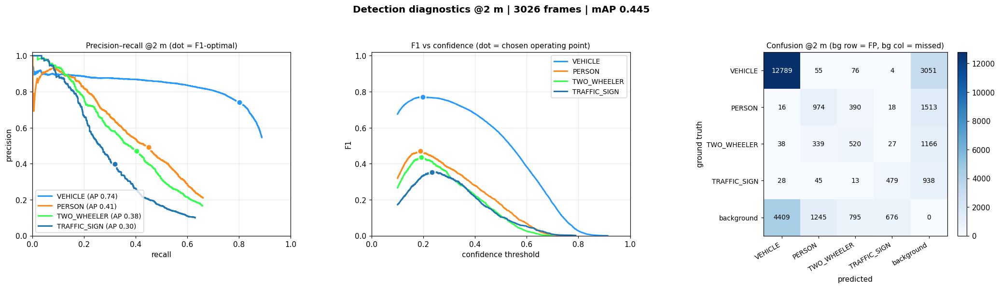

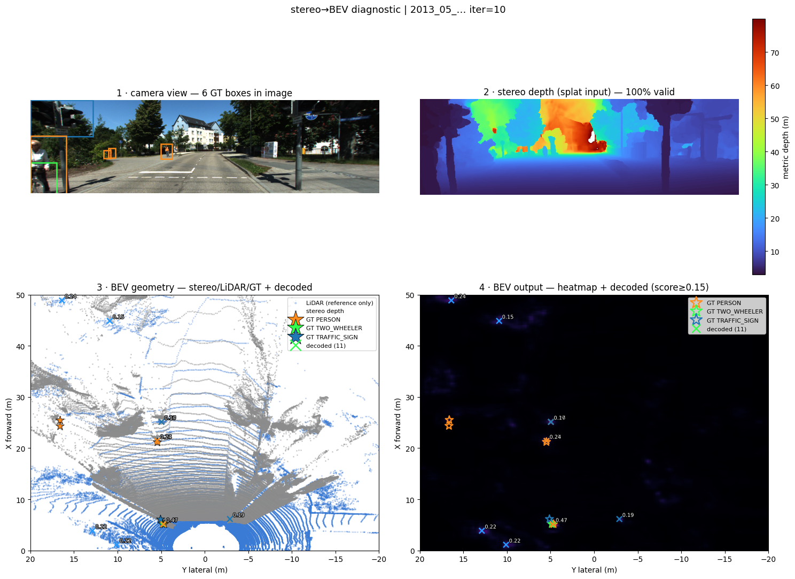

#### 10) PIPELINE A, no depth-ctx

runs/pipeline_a_yolo26_igev_20260708_004840 — git 378f6c9

PipelineA: 1,359,686 trainable | 2,572,280 frozen (yolo26 backbone)

Same config as #9 minus depth context (use_depth_context=false). EPOCHS=50, PATIENCE=5 — ran 8 epochs and stopped on patience (best-val checkpoint = epoch 3, lowest val_loss 2.184). ~3h34m wall clock.

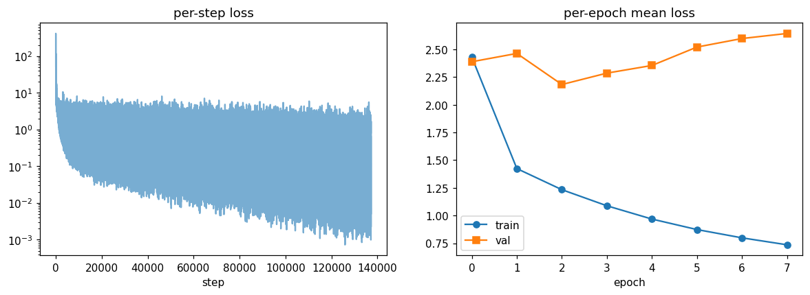

class         AP@0.5  AP@1    AP@2    AP@4      mean   n_gt
-----------------------------------------------------------
VEHICLE       0.590   0.703   0.757   0.773   0.706  15975
PERSON        0.438   0.446   0.448   0.465   0.449  2911
TWO_WHEELER   0.278   0.332   0.352   0.367   0.332  2090
TRAFFIC_SIGN  0.277   0.283   0.292   0.312   0.291  1503

F1-optimal operating point @2 m (apply 'confidence >= score' at deployment):
class         prec    recall  F1      score   
----------------------------------------------
VEHICLE       0.760   0.773   0.767   0.216   
PERSON        0.540   0.468   0.501   0.186   
TWO_WHEELER   0.395   0.427   0.410   0.213   
TRAFFIC_SIGN  0.415   0.285   0.338   0.254   

mAP 0.4445 | macro P 0.528 R 0.488 F1 0.504 @2 m | mean centre error (TP@2m) 0.329 m | 3026 frames

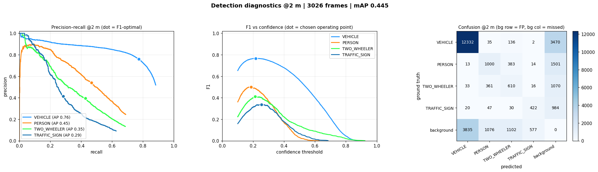

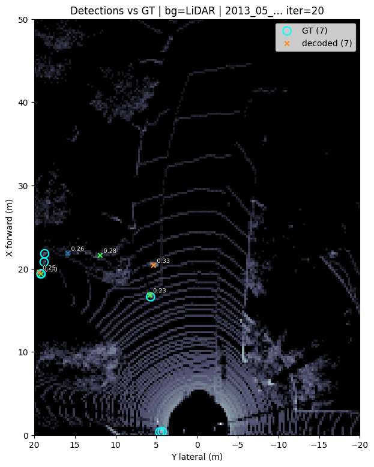

Depth context vs not: near-identical mAP (0.445 vs 0.4445). Depth-ctx wins TWO_WHEELER (+0.038 mean AP) and TRAFFIC_SIGN (+0.009); no-depth-ctx wins PERSON (+0.035) and VEHICLE (+0.010). Both beat PIPELINE C no-depth (#8, mAP 0.437) on mAP and centre error, on 5.4k fewer trainable params — but #8's macro F1 (0.511) and precision (0.590) are still the best of the three, driven by TRAFFIC_SIGN precision (0.586 vs 0.398/0.415).


#### 10) PIPELINE C, with depth

class         AP@0.5  AP@1    AP@2    AP@4      mean   n_gt
-----------------------------------------------------------
VEHICLE       0.523   0.678   0.733   0.746   0.670  15975
PERSON        0.325   0.330   0.335   0.348   0.334  2911
TWO_WHEELER   0.242   0.285   0.290   0.302   0.280  2090
TRAFFIC_SIGN  0.258   0.265   0.274   0.294   0.273  1503

F1-optimal operating point @2 m (apply 'confidence >= score' at deployment):
class         prec    recall  F1      score   
----------------------------------------------
VEHICLE       0.745   0.795   0.769   0.191   
PERSON        0.438   0.356   0.393   0.170   
TWO_WHEELER   0.373   0.365   0.369   0.133   
TRAFFIC_SIGN  0.397   0.279   0.327   0.261   

mAP 0.389 | macro P 0.488 R 0.449 F1 0.465 @2 m | mean centre error (TP@2m) 0.359 m | 3026 frames

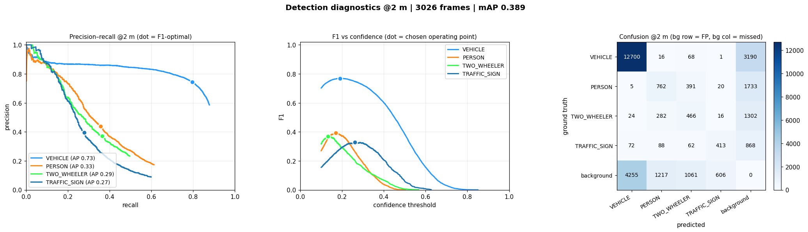


#### 10) PIPELINE C, with depth and gaussian attention

class         AP@0.5  AP@1    AP@2    AP@4      mean   n_gt
-----------------------------------------------------------
VEHICLE       0.685   0.842   0.904   0.916   0.837  11232
PERSON        0.350   0.382   0.390   0.409   0.383  1532
TWO_WHEELER   0.233   0.275   0.286   0.308   0.276  1427
TRAFFIC_SIGN  0.189   0.193   0.204   0.234   0.205  1077

F1-optimal operating point @2 m (apply 'confidence >= score' at deployment):
class         prec    recall  F1      score   
----------------------------------------------
VEHICLE       0.886   0.833   0.859   0.265   
PERSON        0.438   0.415   0.426   0.169   
TWO_WHEELER   0.452   0.345   0.392   0.137   
TRAFFIC_SIGN  0.348   0.272   0.306   0.233   

mAP 0.425 | macro P 0.531 R 0.467 F1 0.496 @2 m | mean centre error (TP@2m) 0.348 m | 3125 frames

stopped before


