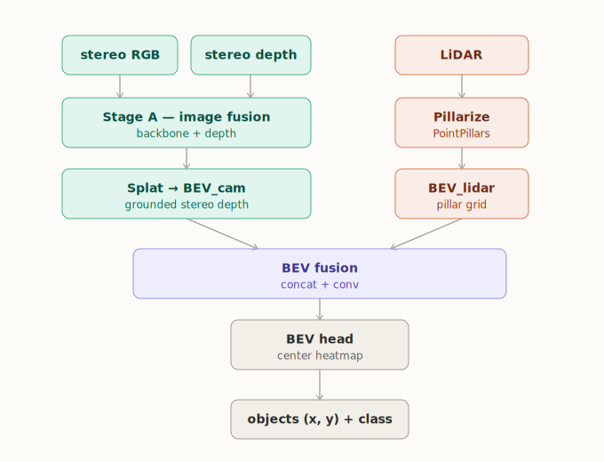
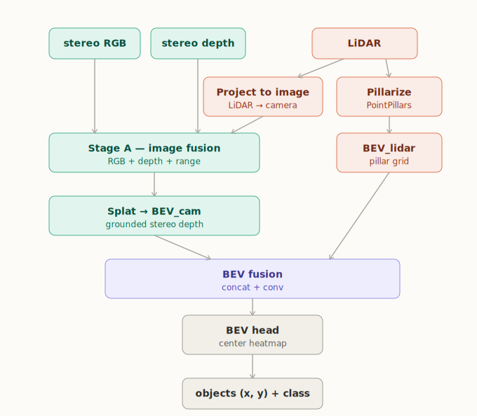
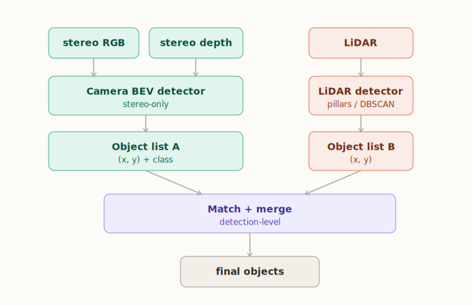

# stereo-lidar-perception

**Stereo + LiDAR fusion for 3D object detection in bird's-eye view.**

A Computer Vision course project (AIRO master's program, Sapienza University of Rome) by three members of the [Fast Charge](https://sapienzafastcharge.it/) Formula Student Driverless team. The method is developed and benchmarked on **KITTI-360** and designed to port to the team's driverless car for cone detection.

---

## Idea

Combine a stereo camera and a LiDAR into a single top-down (bird's-eye-view) detector that outputs each object's ground position `(x, y)` and class — exactly what mapping, SLAM and motion planning consume.

Two principles drive the design:

- **Fuse only where data are aligned.** RGB and stereo depth share the image plane, so they fuse in 2D; the LiDAR lives in its own frame, so the two sensors only meet in a common **bird's-eye-view (BEV)** grid.
- **Use measured depth, not predicted depth.** Most camera–LiDAR detectors fuse LiDAR with a *monocular* camera and must estimate per-pixel depth to lift features into 3D — an error-prone step. We have **stereo** depth, so each camera feature is placed into its correct BEV cell by geometry rather than by a learned guess. This is the core novelty.

## Architecture

The main pipeline (mid fusion) has two branches that meet once, in BEV. Each
stage below maps to one block in [`network.py`](network.py):

1. **Camera backbone** — turns the left image into a grid of semantic features.
2. **Splat to BEV** — places those features on the ground plane using stereo depth (no learnable parameters; pure geometry).
3. **LiDAR stem** — encodes the LiDAR BEV map into features (already top-down).
4. **Fusion** — both branches now share the grid, so they are stacked and convolved. This block is swappable (cross-attention drops in here).
5. **BEV backbone** — 2D context reasoning over the fused grid.
6. **Center head** — per-class heatmap + sub-cell offset, decoded into an object list.

## Architectures explored

We compare four fusion strategies along a single axis — *where the two sensors meet*. The lower the purple block, the later the fusion and the more independent the branches.

| A — Mid fusion: image + BEV *(primary)* | B — + painted LiDAR range |
| :---: | :---: |
|  |  |
| **C — Cross-attention fusion** | **D — Late fusion (baseline)** |
|  |  |

## Dataset

We use **KITTI-360** through the [`py123d`](https://pypi.org/project/py123d/) loader. It is the only py123d dataset that combines everything this project needs (see [docs/dataset.md](docs/dataset.md) for the full comparison):

- a real **colour stereo** camera pair (most AV datasets are mono/surround; Argoverse 2 has a stereo pair but it is grayscale),
- a dense **LiDAR** (Velodyne HDL-64, ~114k points/sweep),
- human-annotated **3D bounding boxes** + ego poses and calibration.

**Classes used:** `VEHICLE` (development and stability), `PERSON`, and `TWO_WHEELER` (KITTI-360 has no traffic cones; the cone transfer target will come from AV2/CARLA later). The loader is dataset-agnostic, so switching back to Argoverse 2 only means flipping the dataset block in `globals.py`.

## Installation

### 1. Install the dataset library

```bash
pip install py123d
```

### 2. Get the login-gated annotation files (once)

Register (free) at [cvlibs.net/datasets/kitti-360](https://www.cvlibs.net/datasets/kitti-360/) and download the three small archives — **Calibrations** (~3K), **Vehicle Poses** (~9M), **3D Bounding Boxes** (~30M) — then unzip them under `KITTI-360/` in the repo root (`calibration/`, `data_poses/`, `data_3d_bboxes/`). If a teammate already has them, copying those three folders works too.

### 3. Download + convert the sensor data (scripted)

The raw stereo images and LiDAR scans are on a **public** S3 bucket — one script downloads, extracts and converts them into `data/logs/kitti360_{train,val}/`:

```bash
# smoke test — smallest sequence (~3 GB), all into kitti360_train
scripts/get_kitti360.sh

# real train/val split (~25 GB): train = drives 0003+0007, val = drive 0010
TRAIN_SEQ="0003 0007" VAL_SEQ="0010" scripts/get_kitti360.sh
```

The script is idempotent (re-runs skip already-extracted sequences), checks the gated files from step 2, and verifies the converted splits (frame counts, colour, LiDAR, boxes, baseline) at the end.

## Usage

Set the dataset roots before running (the loader also auto-fills them from the repo layout):

```bash
export PY123D_DATA_ROOT="$PWD/data"          # converted Arrow logs
export KITTI360_DATA_ROOT="$PWD/KITTI-360"   # raw images / LiDAR blobs
```

The `py123d` Scene API gives frame-by-frame access:

```python
scene_api.get_lidar_at_iteration(iteration, "lidar_top")        # LiDAR point cloud
scene_api.get_camera_at_iteration(iteration, "pcam_stereo_l")   # stereo camera
scene_api.get_box_detections_se3_at_iteration(iteration)        # 3D box labels
scene_api.get_ego_state_se3_at_iteration(iteration)             # ego pose
```

## Code structure

Six modules (the prescribed layout):

| File | Role |
| --- | --- |
| `globals.py` | Single source of truth: shared BEV grid, channel contract, classes. |
| `utils.py` | Visualization helpers (LiDAR density BEV + GT boxes, frustum, clusters). |
| `data.py` | Dataset loading (`StereoSample`) **and** the geometric preprocessing representations: stereo depth/BEV, voxel grid, frustum points, clustering. |
| `network.py` | Full architecture — one block per diagram node: camera branch (Mono/Stereo BEV), LiDAR stem (PointPillars), fusion, BEV backbone, CenterPoint head. |
| `train.py` | BEV target encoder (`TargetEncoder`), CenterPoint loss (Gaussian-focal heatmap + masked L1 offset), single-frame overfit harness + multi-frame training loop (`train_model`). |
| `evaluation.py` | `CenterPointDecoder` (max-pool NMS → metric `(x, y)` + class + score) and center-distance AP (`evaluate_model` @0.5/1/2/4 m, per class). CDS *(TODO)*. |

## Evaluation

Two single-sensor baselines (camera-only and LiDAR-only) set the floor — fusion must beat both. Detection is scored with a **center-distance AP** metric (Argoverse-style bands: true positives at 0.5 / 1 / 2 / 4 m) plus the composite detection score, reported per class and stratified by range. The metric only needs GT centres, so it is dataset-agnostic.

## References

- **BEVFusion** — Multi-Task Multi-Sensor Fusion with Unified BEV Representation. [arXiv:2205.13542](https://arxiv.org/abs/2205.13542)
- **SLBEVFusion** — 3D detection using stereo camera and LiDAR fusion with BEV (Neurocomputing, 2024).
- **FutrTrack** — Camera-LiDAR Fusion Transformer for 3D MOT. [arXiv:2510.19981](https://arxiv.org/abs/2510.19981)
- **KITTI-360** — A Novel Dataset and Benchmarks for Urban Scene Understanding in 2D and 3D. [arXiv:2109.13410](https://arxiv.org/abs/2109.13410)
- **Argoverse 2** — Next Generation Datasets for Self-Driving Perception and Forecasting. [arXiv:2301.00493](https://arxiv.org/abs/2301.00493)

## Authors

Leonardo Galgano · Lorenzo Gaudino · Vittorio Cava — Sapienza University of Rome, Fast Charge Driverless.
