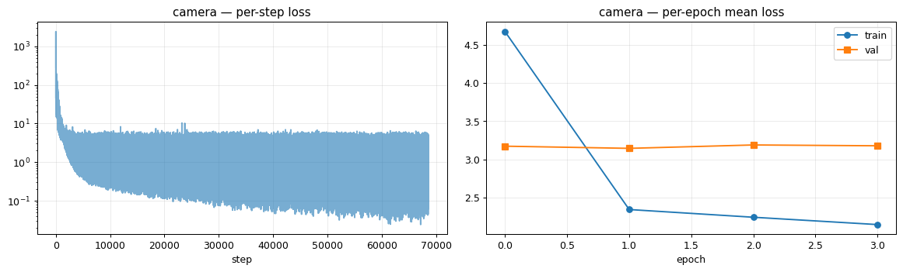
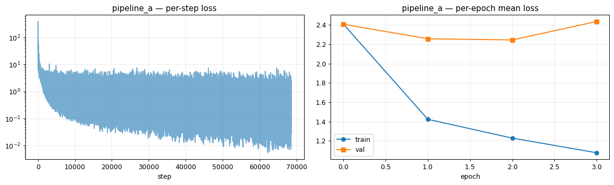
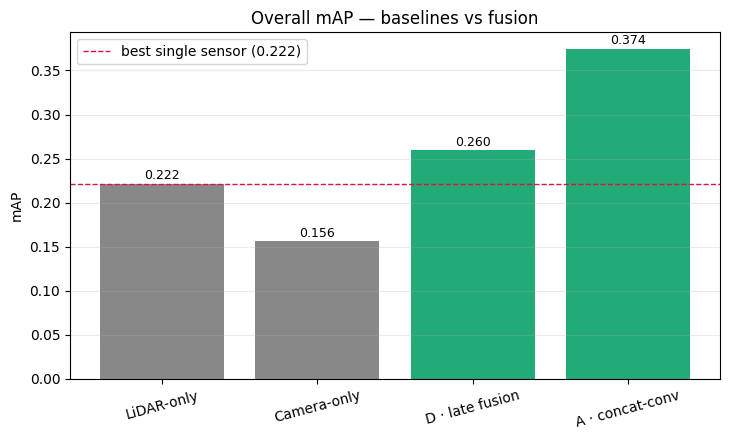
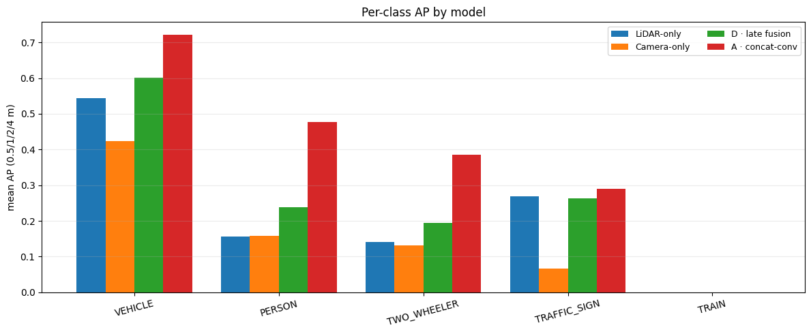
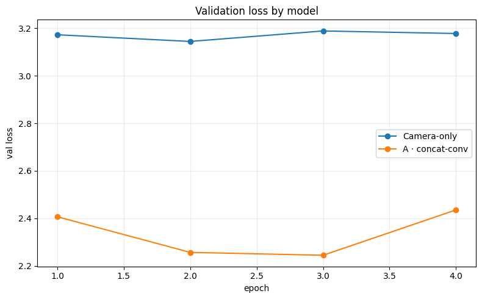

# Stereo Depth Matcher Study & Detection Baselines (KITTI-360)

This document records the stereo-depth work and the first end-to-end detection
results on KITTI-360: which stereo matcher to feed the camera BEV branch, and
the camera-only / LiDAR-only / mid-fusion (Pipeline A) numbers that set and beat
the single-sensor floor.

**All numbers below are measured on this repo's KITTI-360 data — nothing is
extrapolated.** Depth accuracy is scored against LiDAR ground truth; detection is
scored with center-distance AP.

---

## TL;DR

- **Depth matcher:** `SGBM` (classic block matching) is sparse (~60 % of the
  image) with holes on textureless road/sky. A **WLS** post-filter densifies but
  **worsens metric accuracy at every setting** → rejected. **IGEV-Stereo**
  (learned, KITTI-15 weights) is **dense (~100 %) *and* accurate** → adopted as
  the camera-branch depth source.
- **Detection (center-distance AP, real split: train = drives 0003+0007+0009,
  val = held-out drive 0010, 3026 frames, all 4 classes, yolo26 camera stem):**

  | model | mAP | VEHICLE mean AP | PERSON mean AP | TWO_WHEELER mean AP | TRAFFIC_SIGN mean AP | centre err |
  |---|---|---|---|---|---|---|
  | Camera-only (IGEV depth) | 0.156 | 0.424 | 0.159 | 0.131 | 0.067 | 0.61 m |
  | LiDAR-only (PointPillars) | 0.222 | 0.543 | 0.156 | 0.140 | 0.269 | 0.47 m |
  | Pipeline D (late fusion) | 0.260 | 0.601 | 0.239 | 0.194 | 0.264 | 0.48 m |
  | **Pipeline A (mid fusion)** | **0.374** | **0.721** | **0.476** | **0.386** | **0.290** | **0.35 m** |

  Mid fusion (Pipeline A) beats every other model on every class, and clearly
  beats late fusion (mAP 0.374 vs 0.260) — fusing *before* the head lets the
  network use both sensors' geometry jointly instead of only merging their
  final boxes. See §3 for the full per-threshold table and caveats.
- With the full 3-drive training split, `PERSON` / `TWO_WHEELER` are no longer
  0 AP (unlike the early single-drive runs below) — more urban data made them
  learnable.

---

## 1. Setup

- **Hardware:** NVIDIA RTX 2060 (6 GB), PyTorch 2.9.1 + CUDA 12.8.
- **Dataset (current, §3):** KITTI-360 via `py123d`, the real split baked in at
  convert time — `kitti360_train` = drives **0003+0007+0009**,
  `kitti360_val` = held-out drive **0010** (3026 frames). This is what
  `training.ipynb`'s `SPLIT_MODE="auto"` picks up once both named splits exist
  (`scripts/get_kitti360.sh`).
- **Dataset (matcher study, §2, and the early single-drive runs in §3.2):** an
  earlier, smaller interim split used before drive 0010 was converted —
  `kitti360_train` = drives **0003** (1010 frames) + **0007** (2890 frames),
  held out one log via `split_frames(val_scenes=1)`. Kept here because the
  matcher-study conclusion (§2) doesn't depend on the split or the backbone.
- **Classes:** `VEHICLE`, `PERSON`, `TWO_WHEELER`, `TRAFFIC_SIGN` (`globals.CLASSES`).
- **Training:** Adam/AdamW, lr 1e-3, gradient accumulation 4 (batch-1 branches),
  seed 0, best-val checkpoint. Loss = CenterPoint 2D (Gaussian-focal heatmap +
  masked L1 centre offset). §3.1's models each use their own best-known config
  (camera stem, YOLO taps, dropout, depth-context — see §3.1 note); §3.2's
  history rows share one fixed config as originally designed.
- **Detection metric:** center-distance AP at 0.5 / 1 / 2 / 4 m (AV2 bands), per
  class; `mAP` = mean over classes with GT; `centre err` = mean centre error of
  true positives at the 2 m band. (Only needs GT centres — dataset-agnostic.)
- **Depth metric:** absolute error vs LiDAR ground truth. GT is the ego LiDAR
  projected into the original left image (z-buffered nearest surface); error is
  taken on pixels where both GT and stereo are valid, in [1, 80] m. `density` =
  fraction of the image with a valid depth value.

---

## 2. Stereo depth matcher study

### 2.1 Pluggable matcher (implementation)

`data.StereoSGBMConfig.matcher` selects the depth source; everything downstream
keys off the disparity, so the whole pipeline (rectify → match → depth →
reproject → BEV splat) is unchanged:

- `"sgbm"` — classic `cv2.StereoSGBM` (default, unchanged behaviour).
- `"sgbm_wls"` — SGBM + WLS post-filter (see 2.2).
- **learned matchers** via `data.LEARNED_MATCHERS` — a registry
  (`name -> callable(rect_left, rect_right, cfg) -> disparity`) so heavy model
  code stays an *optional external* dependency (like `ultralytics` for YOLO).
  `igev_matcher.register()` adds `"igev"` (see 2.3).

`_match_disparity` dispatches inside `stereo_depth`. The default `"sgbm"` path is
byte-identical to before; the stereo test suite (`tests/test_stereo.py`) passes
6/6 (1 skip: needs precomputed LiDAR depth maps).

### 2.2 WLS post-filter — benchmarked and rejected

WLS (`cv2.ximgproc.DisparityWLSFilter`, canonical, run via an isolated
`opencv-contrib-python`) does left/right-consistency + edge-aware smoothing. It
**densifies but degrades metric accuracy at every λ**, even on the *common
support* (pixels valid in both SGBM and WLS):

**Overall (train, 6 frames, LiDAR GT, canonical WLS, λ = 8000):**

| | density | MAE | %<2 m |
|---|---|---|---|
| SGBM | 65.0 % | **0.99 m** | **90.5 %** |
| SGBM + WLS | 72.8 % | 1.85 m | 78.4 % |

**Common-support MAE (same pixels), λ sweep:**

| λ | MAE SGBM | MAE WLS | winner |
|---|---|---|---|
| 100 (val, 8 fr) | 1.70 | 1.83 | SGBM |
| 1000 | 0.97 | 1.21 | SGBM |
| 8000 | 0.98 | 1.68 | SGBM |
| 20000 | 0.98 | 1.94 | SGBM |

No λ sweet spot — lower λ only approaches SGBM from the worse side. **Why:**
global disparity smoothing biases depth, and depth ∝ 1/disparity amplifies it at
mid/far range; KITTI-360's rectified pair is already clean and SGBM is already
edge-respecting, so the WLS prior only hurts. For a geometric BEV splat, denser
*but noisier* points are a net negative (BEV ghost cells). Kept as an opt-in
ablation row; default stays `sgbm`.

### 2.3 IGEV-Stereo — benchmarked and adopted

**Model:** IGEV-Stereo (Xu et al., CVPR 2023; `gangweiX/IGEV`) with **KITTI-15
finetuned weights** (HF mirror `shriarul5273/IGEV-Stereo`, `kitti15.pth`) —
domain-matched to KITTI-360. Loaded with `weights_only=True` (tensor-only).
Runs on the RTX 2060 at **< 1 GB VRAM, ~0.5 s/frame**, `iters=16` (32 iterations
give **no** measurable gain here), fully dense.

**Benchmark (train, 10 frames, LiDAR GT, [1, 80] m):**

Each matcher scored on *its own* valid pixels ∩ GT (so IGEV is scored on ~40 pts
more coverage, including harder pixels SGBM refuses):

| range | SGBM MAE | IGEV MAE |
|---|---|---|
| 1–10 m | 0.24 | 0.32 |
| 10–20 m | 0.73 | 1.13 |
| 20–30 m | 1.79 | 3.03 |
| 30–50 m | 3.10 | 6.06 |
| 50–80 m | 5.32 | 7.17 |
| **1–80 m (all)** | **1.35** | 1.61 |
| **density** | **59.5 %** | **99.6 %** |
| runtime | 0.14 s (CPU) | 0.53 s (GPU) |

Head-to-head on the **common support** (same pixels valid in both — the fair
comparison):

| range | MAE SGBM | MAE IGEV | winner |
|---|---|---|---|
| 1–10 m | 0.21 | **0.20** | IGEV |
| 10–20 m | 0.90 | **0.80** | IGEV |
| 20–30 m | 2.15 | 2.15 | tie |
| 30–50 m | 5.34 | 5.52 | SGBM (IGEV better median) |
| 50–80 m | 6.02 | 6.67 | SGBM (median 3.41 → **2.85**) |
| **1–80 m (all)** | 1.35 | 1.36 | ~tie |

**Reading:** IGEV **wins the near/mid field** (≤ 20 m — the BEV-relevant range,
grid is x ≤ 50 m) and is **~tied overall on accuracy**, while turning the sparse
60 % into a dense ~100 %. Far range (> 30 m) is baseline-limited for both (0.594 m
stereo baseline) — IGEV has better medians but a worse mean (a few large outliers
from predicting the hard far pixels SGBM skips); those are filtered by the depth
range [0.5, 80] m and the BEV `z_range` [−3, 1] m. **The win is dense coverage at
equal accuracy — exactly what the camera BEV splat needs.**

### 2.4 Depth → BEV, visualized

See **`docs/img/depth_igev_vs_sgbm.png`** — 3 real frames × {RGB, SGBM depth,
IGEV depth, SGBM BEV, IGEV BEV, precision scatter}. Each depth panel is annotated
with density **and** accuracy (MAE, %<2 m). Observations:

- SGBM depth has large **holes** (white) on textureless road/sky; IGEV is dense.
- These holes propagate into the **BEV occupancy** (fraction of grid cells
  filled): IGEV BEV **34 / 26 / 24 %** vs SGBM **28 / 22 / 18 %** across the three
  frames. The BEV gap is smaller than the depth-density gap because BEV pooling
  collapses per-pixel density into cells (a cell is occupied if *any* point lands
  in it), but IGEV consistently fills more of the near-field fan.
- The precision scatter (GT vs estimated depth) shows both matchers on-diagonal;
  IGEV spreads a bit more at long range.

### 2.5 Precompute cache (dense depth at zero training cost)

`data.precompute_stereo_inputs` runs the matcher once per frame and caches the
camera-branch inputs (rectified image + depth + K + extrinsic). The cache root is
**matcher-aware**: `stereo_cache_root(matcher="igev")` →
`preprocessed/stereo_inputs_igev` (SGBM keeps `stereo_inputs`), so both coexist
for the depth ablation. Precompute now skips the in-box point mask (`point_mask=
False`) since the cache doesn't need it.

The full IGEV cache is built for **train + val (6926 frames, 4.6 GB)**; training
reads dense IGEV depth per step with **no matcher at runtime** (~0.5 s/frame paid
once, ~28 min/split on the RTX 2060).

---

## 3. Detection baselines & Pipeline A

### 3.1 Current results — full split, all 4 classes, yolo26 + IGEV

`val` = held-out drive **0010**, 3026 frames, all four `globals.CLASSES`. Each
model below is its own best-known config so far (camera stem always yolo26
COCO-pretrained frozen; Pipeline A additionally uses `yolo_levels="p3p4"` +
`use_depth_context=True` + `head_dropout=0.1`, camera-only uses `"p3"` and no
dropout/depth-context) — **this is not a controlled single-variable ablation**,
just the current best number per model. See §3.2 for the controlled comparison.

| model | mAP | mean err | VEHICLE | PERSON | TWO_WHEELER | TRAFFIC_SIGN |
|---|---|---|---|---|---|---|
| Camera-only (IGEV) | 0.156 | 0.61 m | 0.424 | 0.159 | 0.131 | 0.067 |
| LiDAR-only | 0.222 | 0.47 m | 0.543 | 0.156 | 0.140 | 0.269 |
| Pipeline D (late fusion) | 0.260 | 0.48 m | 0.601 | 0.239 | 0.194 | 0.264 |
| **Pipeline A (mid fusion)** | **0.374** | **0.35 m** | **0.721** | **0.476** | **0.386** | **0.290** |

(columns = mean AP over the 0.5/1/2/4 m thresholds, per class.) Pipeline A wins
every class and both the mAP and centre-error columns by a wide margin over
every other model, including late fusion — see §4.







Qualitative detections: `docs/img/{camera,pipeline_a}_yolo26_igev_det_*.png`
(decoded boxes vs GT), `docs/img/lidar_det_*.png`, and the stereo→BEV
diagnostics `docs/img/{camera,pipeline_a}_yolo26_igev_{diagnostics,stereobev_*}.png`
(does the net *see* objects but fail to *place* them, or vice versa).

Result files: `results/{camera_yolo26_igev, pipeline_a_yolo26_igev, lidar,
pipeline_d}.json` (+ `*_history.json` for camera/pipeline_a). Checkpoints:
`checkpoints/{camera_yolo26_igev, pipeline_a_yolo26_igev, lidar}.pt`.

### 3.2 Historical: controlled comparison on the interim single-drive split

Superseded by §3.1 (more data, better backbone) but kept because it is a
*controlled* A/B — same split / seed / 8 epochs / `efficientnet`-from-scratch
camera stem for all three models, `val` = drive 0007 (2890 frames), 3 classes
(`TRAFFIC_SIGN` wasn't tracked yet):

| model | params | best val loss | AP@0.5 | AP@1 | AP@2 | AP@4 | **mean AP** | **mAP** | F1@2 m | centre err |
|---|---|---|---|---|---|---|---|---|---|---|
| Camera-only (IGEV) | 1.07 M | 2.42 | 0.019 | 0.078 | 0.197 | 0.262 | 0.139 | 0.046 | 0.35 | 0.92 m |
| LiDAR-only | 0.22 M | 1.40 | 0.153 | 0.307 | 0.360 | 0.378 | 0.299 | 0.100 | 0.43 | 0.64 m |
| **Pipeline A (fusion)** | 1.62 M | 1.40 | **0.176** | 0.305 | **0.363** | **0.404** | **0.312** | **0.104** | **0.48** | **0.54 m** |

`mAP` averages over all three classes; `PERSON`/`TWO_WHEELER` contribute 0.0
(GT counts 80 / 43 in val 0007) — too little data on a single drive, fixed by
moving to the 3-drive train split in §3.1.

**Branch-dropout ablation (Pipeline A, this run):** zeroing one branch's BEV at
inference bounds the marginal contribution of the other (a zeroed map is a
"silent sensor" the fusion never saw in training, so this bounds — it is not a
retrained single-branch baseline):

| Pipeline A configuration | mAP | VEHICLE mean AP | centre err |
|---|---|---|---|
| Full fusion | **0.104** | 0.312 | 0.54 m |
| Camera branch dropped (LiDAR only) | 0.098 | 0.293 | 0.44 m |
| LiDAR branch dropped (camera only) | 0.001 | 0.003 | 1.39 m |

LiDAR carried this fusion (dropping the camera only cost 0.098 vs 0.104);
dropping LiDAR collapsed it (0.001) — the fused head had learned to rely on
LiDAR geometry, with the camera contributing a modest sharpening on top.

---

## 4. What we found

1. **Post-filtering (WLS) does not improve depth** on KITTI-360 — it densifies
   but biases; the SGBM disparity is the ceiling for classic matching.
2. **A learned matcher is the real lever.** IGEV-Stereo (KITTI weights, same
   domain) gives **dense (~100 %) depth at accuracy equal-or-better than SGBM in
   the near/mid field**, at < 1 GB VRAM and ~0.5 s/frame (cached once).
3. **Passive stereo is baseline-limited past ~30 m** (0.594 m baseline); no
   matcher fixes this — it is the physics, and it is beyond the 50 m BEV grid.
4. **Mid fusion clearly beats every other option** (§3.1: mAP 0.374 vs 0.260
   late-fusion vs 0.222 LiDAR-only vs 0.156 camera-only) — fusing *before* the
   head lets the network reason jointly over both sensors' geometry, which
   merging final boxes (Pipeline D) cannot recover.
5. **More data made the small classes learnable.** On the single-drive interim
   split (§3.2) `PERSON`/`TWO_WHEELER` sat at 0.0 AP (80/43 GT boxes); on the
   full 3-drive split (§3.1) every class has non-trivial AP.
6. §3.1's numbers are **not yet a controlled ablation** — each model used its
   own best-so-far config (YOLO taps, dropout, depth-context). The clean A/B
   methodology from §3.2 should be re-run on the full split next.

---

## 5. Reproduction

```bash
export PY123D_DATA_ROOT="$PWD/data" KITTI360_DATA_ROOT="$PWD/KITTI-360"

# --- IGEV matcher (optional external deps) ---
# 1. git clone --depth 1 https://github.com/gangweiX/IGEV
# 2. download kitti15.pth (e.g. HF shriarul5273/IGEV-Stereo -> kitti/kitti15.pth)
# 3. pip install timm
export IGEV_ROOT=/path/to/IGEV/IGEV-Stereo  IGEV_CKPT=/path/to/kitti15.pth
```

```python
import data, igev_matcher
from data import Py123dDataset, StereoSGBMConfig, precompute_stereo_inputs, stereo_cache_root

# build the dense IGEV depth cache once (train + val)
igev_matcher.register()
for split in ("kitti360_train", "kitti360_val"):
    precompute_stereo_inputs(Py123dDataset(split_names=[split]),
                             sgbm_cfg=StereoSGBMConfig(matcher="igev"))

# train (reads the cache; no matcher at runtime)
from network import PipelineA, StereoBEVConfig
CACHE = stereo_cache_root(matcher="igev")
model = PipelineA(stereo_cache_root=CACHE,
                  stereo_cfg=StereoBEVConfig(img_backbone="efficientnet"))
```

WLS needs `opencv-contrib-python` (matching the installed `opencv-python`
version); without it `matcher="sgbm_wls"` falls back to a built-in equivalent
(also not recommended, per 2.2). See `igev_matcher.py` for the full setup notes.

---

## 6. Status & next steps

- **Done:** pluggable matcher + IGEV integration + dense cache; camera-only,
  LiDAR-only, Pipeline A and Pipeline D (late fusion) on the full 3-drive
  split with distance-AP; depth→BEV study; MonoBEV (predicted-depth) baseline;
  regularization sweep (dropout/weight-decay/patch-split/YOLO neck taps/
  depth-context); early stopping.
- **Next:** re-run §3.1 as a controlled ablation (fixed config across models,
  per §3.2's methodology) now that the full split exists; IGEV vs SGBM depth
  *through the full network* (§3's numbers all use IGEV; the SGBM cache is
  still partial); StereoBEV (grounded) vs MonoBEV (predicted) head-to-head on
  the same split.
- **Later:** Pipeline B (painted range), Pipeline C (cross-attention fusion),
  CDS + per-range AP bins, Jetson Orin latency, FS-car deployment (ZED depth).

*References: IGEV-Stereo (Xu et al., CVPR 2023); SGBM (Hirschmüller, 2008); WLS
disparity filter (OpenCV ximgproc); Lift-Splat-Shoot (Philion & Fidler, 2020);
PointPillars (Lang et al., 2019); BEVFusion (Liu et al., 2023).*
