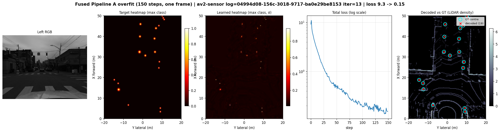
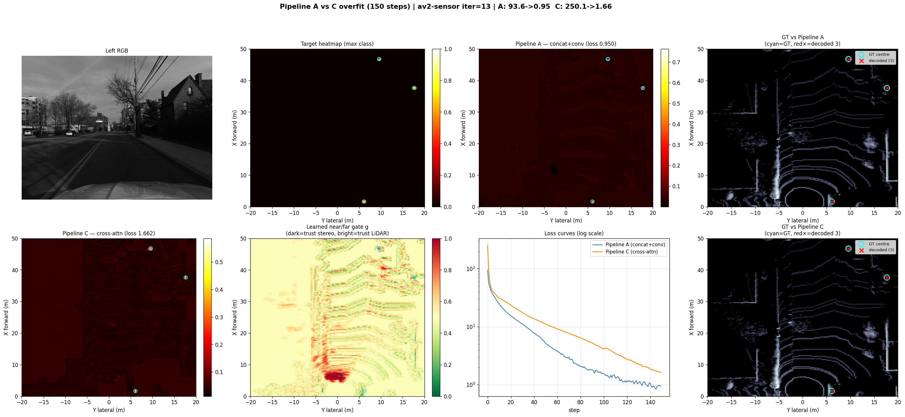

# The Unified Network: CNN & Transformer BEV Fusion (`network.py`)

This document provides a comprehensive technical breakdown of the unified neural network architecture implemented in `network.py`. It explains the structural progression from raw multimodal sensor streams to 3D object detection, with an in-depth focus on the two competing mid-fusion paradigms: **CNN-based Convolutional Fusion (Pipelines A & B)** and **Transformer-based Windowed Cross-Attention Fusion (Pipeline C)**.

---

## 1. Executive Summary & The 6-Stage Architecture

To enable systematic experimentation and clean deployment on edge hardware (NVIDIA Jetson AGX Orin), the entire perception model is consolidated into a single modular file: `network.py`. The architecture follows a linear **6-stage pipeline** where camera and LiDAR data are processed asynchronously in Stage A (sensor stems) before meeting exactly once in Stage B (bird's-eye-view fusion and detection head).

```
    ┌─ Stage 1  Camera Backbone ─────────── _EfficientNetBackbone / YOLOBackbone
    │                                       (Shared BEV Backbone: BEVBackbone2D)
    │  Stage 2  Splat to BEV (Lift) ─────── build_frustum_points / splat / _build_grounded_frustum
    │                                       MonoBEV (Predicted Depth) / StereoBEV (Grounded Depth)
    ├─ Stage 3  LiDAR Stem ──────────────── pillarize / PillarFeatureNet / PointPillarsScatter
    │                                       └─► PointPillarsBranch (128 ch)
    ├─ Stage 4  Mid-Fusion (Swappable) ──── ConcatConvFusion (CNN) / CrossAttentionFusion (Transformer)
    │  Stage 5  BEV Context Backbone ────── Post-fusion 2D spatial context reasoning
    └─ Stage 6  CenterPoint 2D Head ─────── CenterPointHead (Heatmap + Sub-cell Offset)
       Assembly ─────────────────────────── PipelineA / PipelineB / PipelineC / LidarOnlyDetector
```

### Core Invariant: The BEV Contract
Regardless of the internal complexity of the sensor branches or the fusion mechanism, Stage A and Stage B communicate strictly through a fixed tensor contract defined in `globals.py`:
* **Shared BEV Grid (`nx, ny`):** `(200, 160)` cells representing $X \in [0, 50]\text{ m}$ (forward) and $Y \in [-20, 20]\text{ m}$ (lateral) at a resolution of $0.25\text{ m/cell}$.
* **Camera BEV Map (`bev_camera`):** Shape `(B, 64, 200, 160)`.
* **LiDAR BEV Map (`bev_lidar`):** Shape `(B, 128, 200, 160)`.
* **Fused Output (`fused`):** Shape `(B, 128, 200, 160)`.
* **Detection Targets:** 2D ground-planar centers only (no yaw, no $Z$-regression per Design Doc §08), emitting `heatmap (B, num_classes, 200, 160)` and `offset (B, 2, 200, 160)`.

---

## 2. Sensor Front-Ends (Stage 1 – 3)

Before reaching fusion, each sensor modality must be transformed from its native perspective into the canonical 2D ego-vehicle ground grid.

### 2.1 Camera Branch (`StereoBEV` vs. `MonoBEV`)
The camera branch processes left-rectified RGB images ($192 \times 640$) to produce a 64-channel BEV feature map:
1. **Shared 2D Backbone (`Stage 1`):** An `_EfficientNetBackbone` (or optional `YOLOBackbone`) extracts semantic features at $1/8\times$ resolution ($24 \times 80$), outputting $256$ feature channels.
2. **Context Head:** A $3 \times 3$ convolutional head projects the $256$-channel backbone output down to $C=64$ semantic channels per pixel.
3. **Metric Lifting (`Stage 2`):**
   * **`StereoBEV` (Primary Grounded Path):** Instead of guessing depth, the network ingests hard metric depth from the classic SGBM stereo matcher (`data.py`). Each valid pixel is unprojected directly along its camera ray into 3D ego-coordinates:
     $$\mathbf{X}_{\text{cam}} = d \cdot \mathbf{K}_{\text{small}}^{-1} \begin{bmatrix} u + 0.5 \\ v + 0.5 \\ 1 \end{bmatrix}, \quad \mathbf{X}_{\text{ego}} = \mathbf{R}_{\text{cam2ego}} \mathbf{X}_{\text{cam}} + \mathbf{t}_{\text{cam2ego}}$$
   * **`MonoBEV` (Baseline LSS Path):** Predicts a softmax depth distribution over $D=41$ bins ($1\text{ m}$ to $60\text{ m}$), forming an outer product frustum cloud of size $H' \times W' \times D$.
4. **Splatting (Voxel Pooling):** Both camera paths use an O($M \log M$) **sort + cumulative-sum boundary pooling** algorithm (`splat`) to aggregate frustum points falling into the same BEV cell without slow Python loops or non-deterministic `scatter_add` operations.
5. **Refinement:** A lightweight `BEVBackbone2D` ($3 \times 3$ convs + BatchNorm + ReLU) adds local spatial context across neighboring cells.

### 2.2 LiDAR Branch (`PointPillarsBranch`)
The LiDAR branch processes raw 3D sweep arrays of shape `(N, 4)` ($[x, y, z, \text{reflectance}]$):
1. **Pillarization (`pillarize`):** Discretizes the $50\text{ m} \times 40\text{ m}$ frontal volume into $(200, 160)$ vertical columns of infinite height. Points are grouped up to 32 points per pillar across a maximum of 12,000 non-empty pillars. Each point is augmented to a 9-dimensional vector including offsets to the pillar arithmetic mean and cell geometric center.
2. **Pillar Feature Net (`PillarFeatureNet`):** A simplified PointNet (Linear $\to$ BatchNorm $\to$ ReLU) applied point-wise, followed by a max-pooling operation over the points in each pillar, yielding a robust 64-channel embedding per cell.
3. **Scatter & BEV Backbone (`Stage 3`):** The sparse pillar features are scattered back onto the dense $(200, 160)$ canvas and refined by a `BEVBackbone2D` that expands the channel depth to $128$.

---

## 3. CNN-Based Mid-Fusion: Pipelines A & B (`ConcatConvFusion`)

The convolutional baseline represents the most straightforward and computationally efficient method for combining multimodal BEV feature maps.

```
                  ┌────────────────────────┐
bev_camera (64)  ─┤                        │
                  │  Concatenate (dim=1)   ├─► Cat Map (192) ─► [3x3 Conv, BN, ReLU] x2 ─► Fused Map (128)
bev_lidar (128)  ─┤                        │
                  └────────────────────────┘
```

### 3.1 Mechanism & Channel Mixing
In `ConcatConvFusion`, the two branch outputs are stacked along the channel dimension:
$$\mathbf{F}_{\text{cat}} = \text{cat}\left(\mathbf{F}_{\text{cam}}, \mathbf{F}_{\text{lid}}, \text{dim}=1\right) \in \mathbb{R}^{B \times 192 \times 200 \times 160}$$

Why **concatenation** instead of element-wise addition?
1. **Channel Asymmetry:** The camera branch emits 64 channels (optimizing memory during the 3D frustum splat), whereas the LiDAR branch emits 128 channels. Concatenation preserves 100% of the information from both sensors without forcing an artificial bottleneck or padding.
2. **Feature Scale Independence:** Camera features represent semantic appearance and texture, while LiDAR features represent geometric occupancy and reflectance. Addition would assume comparable feature magnitudes and identical representation semantics.

Once concatenated, the 192-channel tensor passes through a 2-layer $3 \times 3$ convolutional stack (`self.block`):
$$\mathbf{F}_{\text{fused}} = \text{ReLU}\left(\text{BN}\left(\text{Conv}_{3\times3}\left(\text{ReLU}\left(\text{BN}\left(\text{Conv}_{3\times3}\left(\mathbf{F}_{\text{cat}}\right)\right)\right)\right)\right)\right) \in \mathbb{R}^{B \times 128 \times 200 \times 160}$$

This convolutional stack doubles as **Stage 5 (BEV Backbone)**, mixing cross-modal channels while extending the spatial receptive field across adjacent BEV grid cells before feeding the detection head.

### 3.2 The Strict Spatial Alignment Requirement
Convolutional fusion is governed by a foundational geometric rule (Design Doc §02):
> **Two feature maps may be combined cell-by-cell only if their cells refer to the exact same physical space.**

Because a $3 \times 3$ convolution operates on fixed grid indices $(ix, iy)$, `ConcatConvFusion` assumes that cell $(100, 80)$ in `bev_camera` corresponds precisely to cell $(100, 80)$ in `bev_lidar`. If camera calibration drifts, or if passive stereo matching produces erroneous depth estimates, the camera features will land in incorrect BEV cells. Under convolutional fusion, misaligned features cannot attend to their true geometric counterparts; instead, the convolution mixes unrelated physical locations, degrading detection accuracy.

`BEVFusion.forward` enforces this invariant at runtime with strict shape and grid alignment guards, raising an assertion error if the spatial dimensions or resolutions diverge.

### 3.3 Pipeline B Variation
`PipelineB` shares the exact same `ConcatConvFusion` module as `PipelineA`. The difference occurs entirely upstream in Stage A: the sparse LiDAR depth returns (`sample.depth_left`) are painted into the camera image space as a 4th channel prior to the backbone and splatting stages (using sparsity-aware convolution). Consequently, the fusion block itself sees the same standard `(64, 200, 160)` and `(128, 200, 160)` contract.

---

## 4. Transformer-Based Cross-Attention Fusion: Pipeline C (`CrossAttentionFusion`)

To overcome the strict spatial alignment limitations of convolutional fusion and dynamically adapt to range-dependent sensor degradation, Pipeline C introduces a **Windowed Cross-Attention Transformer** with learnable spatial near/far gating.

```
bev_camera (64)  ─► [1x1 Proj] ─► cam_e (128) ───┬──► [Queries Q] ──┐
                                                 │                  ├──► Window Cross-Attn ─► attn_out (128) ──┐
bev_lidar (128)  ─► [1x1 Proj] ─► lid_e (128) ───┼──► [Keys/Vals KV]┘                                          │
                                                 │                                                             ▼
                                                 └──────────────────► [Cat, 1x1 Conv, Sigmoid] ─► gate g ─► [Soft Gating] ─► post_conv ─► Fused (128)
```

### 4.1 Motivation: Relaxing Spatial Alignment
Unlike convolutions, **cross-attention does not require pre-aligned cells**. By formatting camera features as queries that search over LiDAR keys and values, attention allows a camera feature in cell $(ix, iy)$ to attend to a LiDAR feature in $(ix + \Delta x, iy + \Delta y)$. This provides resilience against calibration jitter, extrinsic calibration errors, and stereo SGBM disparity noise.

### 4.2 Architectural Walkthrough

#### Step 1: Projection to Shared Embedding Space ($E=128$)
Because standard attention requires matching embedding dimensions for inner products, both BEV maps are projected to a common width $E = 128$ via dedicated $1 \times 1$ convolutions followed by BatchNorm and ReLU:
$$\mathbf{Q}_{\text{raw}} = \text{ReLU}\left(\text{BN}\left(\text{Conv}_{1\times1}\left(\mathbf{F}_{\text{cam}}\right)\right)\right) \in \mathbb{R}^{B \times 128 \times 200 \times 160}$$
$$\mathbf{KV}_{\text{raw}} = \text{ReLU}\left(\text{BN}\left(\text{Conv}_{1\times1}\left(\mathbf{F}_{\text{lid}}\right)\right)\right) \in \mathbb{R}^{B \times 128 \times 200 \times 160}$$

#### Step 2: Windowed Cross-Attention (`_WindowCrossAttention`)
Applying global multi-head attention over a $200 \times 160$ grid produces $N = 32,000$ tokens. Global attention scales quadratically at $O(N^2)$, requiring $32,000^2 \approx 1.024 \times 10^9$ attention weights per layer—computationally prohibitive for real-time inference on the Jetson AGX Orin.

To make attention real-time, `_WindowCrossAttention` partitions the BEV grid into non-overlapping local windows of size $\text{win\_h} \times \text{win\_w}$ (default $8 \times 8$ cells, representing a $2\text{ m} \times 2\text{ m}$ physical patch):
1. **Partitioning (`_partition`):** The grid is reshaped into $25 \times 20 = 500$ independent windows. Within each window, the number of tokens is only $n = 8 \times 8 = 64$.
2. **Computational Complexity:** Attention complexity per window is $O(n^2) = 64^2 = 4,096$ operations. Across all 500 windows, the total computational cost is $500 \times 4,096 \approx 2.04 \times 10^6$ operations—a **500-fold reduction** compared to global attention.
3. **Multi-Head Cross-Attention:** For each window $w \in \{1, \dots, 500\}$ and head $h \in \{1, \dots, 4\}$ (head dimension $d = 128 / 4 = 32$):
   $$\mathbf{Q} = \text{LayerNorm}(\mathbf{Q}_{\text{raw}}), \quad \mathbf{K} = \text{LayerNorm}(\mathbf{KV}_{\text{raw}}), \quad \mathbf{V} = \mathbf{KV}_{\text{raw}}$$
   $$\text{AttnLogits}_{w, h} = \frac{\mathbf{Q}_{w, h} \mathbf{K}_{w, h}^T}{\sqrt{d}} \in \mathbb{R}^{64 \times 64}$$
4. **Swin-Style Learnable Relative Position Bias:** To prevent the model from losing geometric relationships within the $8 \times 8$ window, a learnable relative position bias table $\mathbf{B} \in \mathbb{R}^{(2 \cdot \text{win\_h} - 1)(2 \cdot \text{win\_w} - 1) \times 4}$ is indexed by the discrete relative pixel offset $(\Delta \text{row}, \Delta \text{col}) \in [-7, 7]^2$ between every pair of queries and keys:
   $$\text{AttnWeights}_{w, h} = \text{softmax}\left(\text{AttnLogits}_{w, h} + \mathbf{B}\left[\Delta \text{pos}\right]\right)$$
   $$\mathbf{F}_{\text{attn}} = \text{Unpartition}\left(\text{Linear}_{\text{out}}\left(\text{AttnWeights} \cdot \mathbf{V}\right)\right) \in \mathbb{R}^{B \times 128 \times 200 \times 160}$$
   This relative bias preserves the translation-equivariance of BEV space while allowing the attention heads to learn distinct spatial priors (e.g., attending more strongly to LiDAR keys directly in front of or behind the camera query).

#### Step 3: Spatial Near/Far Gating (`self.gate`)
Passive stereo depth precision degrades quadratically with distance: error is governed by $\Delta z \approx \frac{z^2}{f \cdot b} \cdot \Delta d$. In Argoverse 2 ($f \approx 1688\text{ px}, b \approx 0.5\text{ m}$), stereo SGBM depth error is decimeter-accurate in the near field ($\le 20\text{ m}$, MAE $\approx 0.4\text{ m}$) but severe in the far field ($> 50\text{ m}$, MAE $\approx 9.0\text{ m}$). Conversely, LiDAR accuracy remains stable across the entire range.

To capture this physical reality without manual heuristics, Pipeline C incorporates a **learnable spatial gate** that modulates between camera and attended LiDAR features on a per-cell basis:
$$\mathbf{g} = \sigma\left(\text{Conv}_{1\times1}\left(\text{ReLU}\left(\text{BN}\left(\text{Conv}_{1\times1}\left(\text{cat}\left(\mathbf{Q}_{\text{raw}}, \mathbf{KV}_{\text{raw}}, \text{dim}=1\right)\right)\right)\right)\right)\right) \in (0, 1)^{B \times 1 \times 200 \times 160}$$

The final gated fusion representation is computed as a convex combination:
$$\mathbf{F}_{\text{gated}} = (1.0 - \mathbf{g}) \odot \mathbf{Q}_{\text{raw}} + \mathbf{g} \odot \mathbf{F}_{\text{attn}}$$

* **Near-Field Behavior ($g \to 0$):** When stereo depth is dense and reliable, the network suppresses LiDAR attention and trusts the camera semantic projection directly.
* **Far-Field Behavior ($g \to 1$):** Where stereo depth is sparse or scattered, the network activates the gate, relying on the window-attended LiDAR feature map to anchor the detection.

#### Step 4: Post-Fusion Spatial Context (`self.post_conv`)
A 2-layer $3 \times 3$ convolutional stack processes $\mathbf{F}_{\text{gated}}$ to smooth boundary artifacts between adjacent $8 \times 8$ attention windows and provide final 2D spatial context before emitting the `(B, 128, 200, 160)` output.

---

## 5. Architectural Comparison: CNN vs. Transformer

| Architectural Dimension | ConcatConvFusion (Pipelines A / B) | CrossAttentionFusion (Pipeline C) |
| :--- | :--- | :--- |
| **Primary Mechanism** | Channel concatenation + $3 \times 3$ Convolutions | Windowed Query-Key Cross-Attention + Sigmoid Gating |
| **Computational Complexity** | $O(N \cdot K^2 \cdot C_{\text{in}} \cdot C_{\text{out}})$ (Linear in BEV cells $N$) | $O(N \cdot \text{win}^2 \cdot E)$ ($O(n^2)$ within local $8 \times 8$ windows) |
| **Trainable Parameters** | **~369,000** params | **~450,000** params (includes projection & gate layers) |
| **Spatial Alignment Tolerance** | **Strict:** Assumes cell $(ix, iy)$ in camera exactly matches $(ix, iy)$ in LiDAR. | **Relaxed:** Attention learns soft correspondences across the $8 \times 8$ window ($2\text{ m} \times 2\text{ m}$ patch). |
| **Range-Dependent Adaptivity** | **Static:** Convolution weights are spatially invariant across the grid. | **Dynamic:** Near/far gate $g(x,y)$ dynamically shifts trust from stereo (near) to LiDAR (far). |
| **Receptive Field (in Fusion)** | Local $3 \times 3$ kernel ($0.75\text{ m} \times 0.75\text{ m}$). | Full $8 \times 8$ window ($2.0\text{ m} \times 2.0\text{ m}$) + post-conv smoothing. |
| **Robustness to Calibration Drifting**| Vulnerable to extrinsic rotation/translation jitter. | High resilience due to relative position bias and spatial query search. |
| **Hardware Latency (Jetson Orin)** | Ultra-fast (~1–2 ms in TensorRT). | Moderate (~4–6 ms in TensorRT due to window partitioning/unpartitioning). |

---

## 6. End-to-End Pipeline Composition & Usage

All three design pipelines (`PipelineA`, `PipelineB`, `PipelineC`) inherit from the abstract `Pipeline` base class in `network.py`. The base class manages sensor branch initialization, single-frame stereo SGBM caching, and intermediate activation recording for visualization.

### 6.1 Class Hierarchy
```python
# From network.py (Stage 6 Assembly)
class Pipeline(nn.Module):
    fusion_cls: type[BEVFusion] = ConcatConvFusion  # Default to CNN baseline
    # Owns: self.lidar_branch, self.camera_branch, self.detector

class PipelineA(Pipeline):
    """Pipeline A — mid fusion: stereo-splat + pillars -> concat+conv -> head."""
    pass

class PipelineB(PipelineA):
    """Pipeline B — A plus painted LiDAR-range channel (sparsity-aware conv in Stage A)."""
    pass

class PipelineC(Pipeline):
    """Pipeline C — cross-attention fusion (near->stereo, far->LiDAR)."""
    fusion_cls = CrossAttentionFusion  # Swaps only the fusion block!
```

### 6.2 Practical Code Example
Executing an end-to-end forward pass from raw dataset samples to detection bounding boxes is identical across all pipelines:

```python
import torch
from data import Py123dDataset
from network import PipelineA, PipelineC, describe

# 1. Load an Argoverse 2 validation sample
dataset = Py123dDataset(split_names=["av2-sensor_val"], max_num_scenes=1)
frame   = dataset.get_frame(scene_idx=0, iteration=15)
sample  = frame.to_stereo_sample()
device  = torch.device("cuda" if torch.cuda.is_available() else "cpu")

# 2. Instantiate Pipeline C (Transformer Fusion)
model = PipelineC(num_classes=3).to(device).eval()

# Print contract and parameter distribution
describe(model.detector)

# 3. Enable debug mode to capture stage intermediates
model.debug = True

# 4. End-to-End Forward Pass (async Stage A branches -> Stage B Fusion -> Head)
with torch.no_grad():
    predictions = model(sample, device=device)

# 5. Access Predictions & Intermediates
heatmap = predictions["heatmap"]  # (1, 3, 200, 160) logits (apply sigmoid)
offset  = predictions["offset"]   # (1, 2, 200, 160) sub-cell (dx, dy) in meters

print("Camera BEV shape:", model.intermediates["bev_camera"].shape)  # (64, 200, 160)
print("LiDAR BEV shape: ", model.intermediates["bev_lidar"].shape)   # (128, 200, 160)
print("Fused BEV shape: ", model.intermediates["fused"].shape)       # (128, 200, 160)
```

### 6.3 Diagnostic Visualization & Verification
Because Pipeline C introduces non-trivial gating and cross-attention dynamics, `tests/test_network.py`, `tests/test_overfit.py` and `utils.py` provide specialized verification suites:
* **Gradient Verification (`test_cross_attention_gradients_flow`):** Confirms that loss gradients backpropagate cleanly through the window partitioning, attention projection matrices (`q_proj`, `k_proj`, `v_proj`), and the sigmoid near/far gate.
* **Visual Inspection (`save_fusion_figure`):** Generates a 4-panel comparison rendering the mean absolute activation of `bev_camera`, `bev_lidar`, `fused`, and the final CenterPoint heatmap against ground-truth ego bounding box centers.
* **Overfit sanity (`tests/test_overfit.py`):** drives encoder → model → loss → backward → decoder on one real frame until the GT centres are recovered, for both `PipelineA` (`ConcatConvFusion`) and `PipelineC` (`CrossAttentionFusion`):

  
  

---

## 7. Summary of Key Design Takeaways

1. **Decoupled Sensor Stems:** By standardizing on the $(200, 160)$ grid at $0.25\text{ m/cell}$, camera and LiDAR feature extraction evolve independently without breaking downstream fusion.
2. **Grounded vs. Predicted Geometry:** Grounded stereo SGBM depth (`StereoBEV`) eliminates the need for probabilistic depth distributions in the camera branch, placing features on the ground plane via pure metric triangulation.
3. **The Fusion Dichotomy:** `ConcatConvFusion` offers an ultra-lightweight, high-speed baseline when calibration is pristine and spatial alignment is exact. `CrossAttentionFusion` provides a robust, range-adaptive alternative that mitigates far-field stereo degradation and calibration drift at the cost of modest windowed attention overhead.
4. **Future Work — Gaussian Kernel Attention Ablation:** Inspired by UniCorrn [3], future iterations of Pipeline C could explore replacing standard scaled dot-product attention ($\frac{QK^T}{\sqrt{d_k}}$) with Gaussian kernel attention based on pairwise Euclidean distance ($\text{Softmax}\left(-\frac{\text{Pair\_L2}(Q, K)}{\sqrt{D}}\right)$).
   * **Pros:** Dot-product attention measures linear correlation and is sensitive to magnitude variations across heterogeneous sensor feature distributions. L2 distance acts as a non-linear kernel that matches camera and LiDAR features based on true Euclidean descriptor proximity, creating a smoother RBF similarity landscape less prone to softmax logit saturation.
   * **Cons:** Standard dot-products map directly to hardware-accelerated GEMM and FlashAttention kernels on NVIDIA Tensor Cores. Computing pairwise L2 distances ($\|q - k\|^2 = \|q\|^2 + \|k\|^2 - 2qk^T$) increases memory bandwidth and introduces custom element-wise operations that degrade inference latency on embedded platforms like the Jetson.

---

## 8. References

1. **Swin Transformer:** Liu et al., *"Swin Transformer: Hierarchical Vision Transformer using Shifted Windows"*, ICCV 2021. [arXiv:2103.14030](https://arxiv.org/abs/2103.14030) *(Inspiration for local $8 \times 8$ window partitioning and learnable relative position bias).*

2. **FutrTrack:** *"Camera-LiDAR Fusion Transformer for 3D MOT"*, 2025. [arXiv:2510.19981](https://arxiv.org/abs/2510.19981) *(Transformer-based cross-modal attention).*

3. **UniCorrn:** Goswami et al., *"UniCorrn: Unified Correspondence Transformer Across 2D and 3D"*, 2026. [arXiv:2605.04044](https://arxiv.org/abs/2605.04044) *(Theoretical reinforcement for using 2D camera queries to attend to 3D LiDAR/point cloud features within a unified, geometrically aware cross-attention embedding space).*
